# Characterization and Modeling of GaN HEMTs

Tianyang (Eliot) Chen | Advisor: Patrick Fay | 2024 Summer

> *Click the hyperlink in the table of contents to navigate to the corresponding section.*

[TOC]

## ==Introduction==

### ==Overview==

#### ==About this Work==

#### ==About this Documents==

#### ==Updates and Releases==

### ==Gallium Nitride (GaN) High-Electron-Mobility Transistors (HEMTs)==

#### ==Concepts==

#### ==Modeling Techniques==

- **Physics Based Models:**

- **ANN Based Models:**

- **Empirical Models:**

### ==Angelov Model==

#### ==A Review==

#### ==Angelov GaN Model==

### ==Integrated Circuit Characterization and Analysis Program (IC-CAP)==

#### ==Settings==

#### ==Data Measurements==

#### ==Parameter Extractions==

[Back to Table of Contents](#Characterization and Modeling of GaN HEMT)

## ==Characterization==

### ==Hardware Configurations==

### ==Measurement Flow Design==

#### ==DC Measurements==

#### ==RF Measurements==

### ==Measurements with Risk Managements==

#### ==Instrument Setups==

#### ==Measurement Settings==

#### ==Pad Open/Short and De-Embed==

#### ==Measurements==

[Back to Table of Contents](#Characterization and Modeling of GaN HEMT)

## ==Modeling==

### ==Angelov GaN Parameters==

### ==Parameter Calculations from IC-CAP== 

#### ==Extraction Flow Overview==

#### ==IC-CAP Data Output==

#### ==Debugging==

### ==Extractions==

#### ==DC==

#### ==RF==

### ==Simulations and Optimizations==

#### ==Significant Parameters and Analysis==

#### ==Results (Updated at Aug 29 2024)==

[Back to Table of Contents](#Characterization and Modeling of GaN HEMT)

## ==Appendix==

### ==Keysight: Angelov-GaN Parameters Definitions and Default Values==

### ==Notes on the IC-CAP Help Doc==

#### Parameter Extraction Flow Example

0. Example Parameter Extraction Flow

   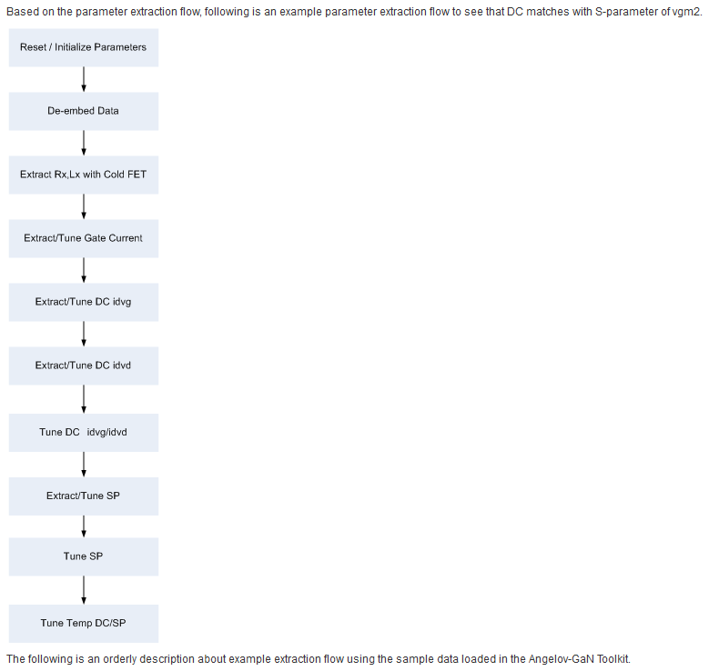

1. Initialize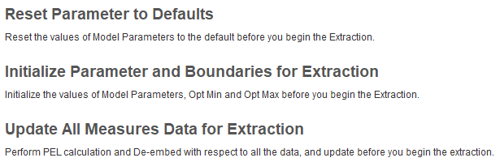

2. DC Port Resistance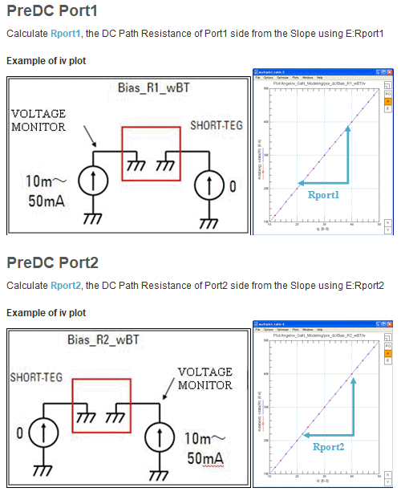

3. SP Cold FET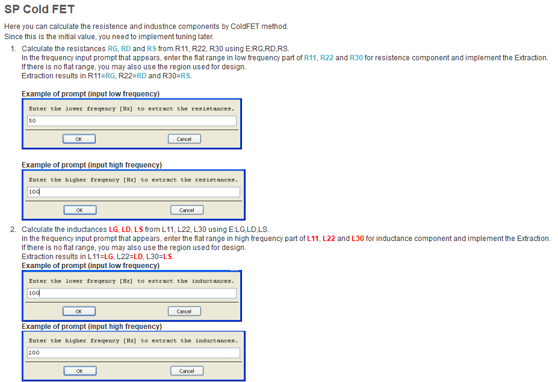

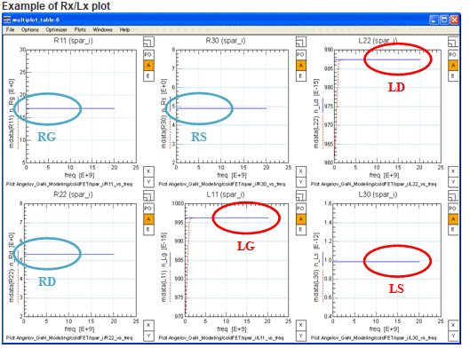

4. Gate Diode

   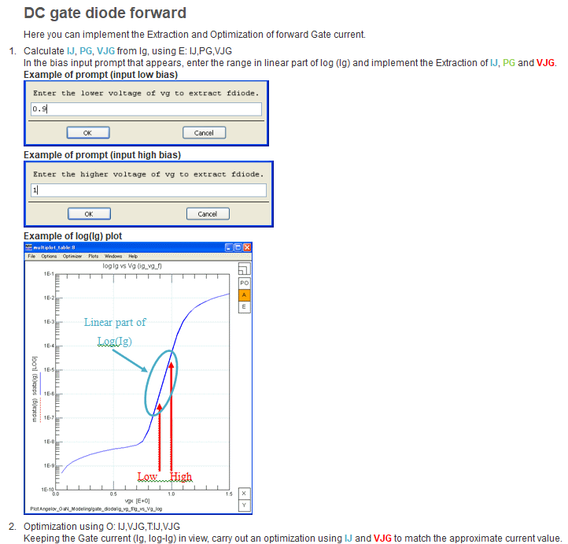

   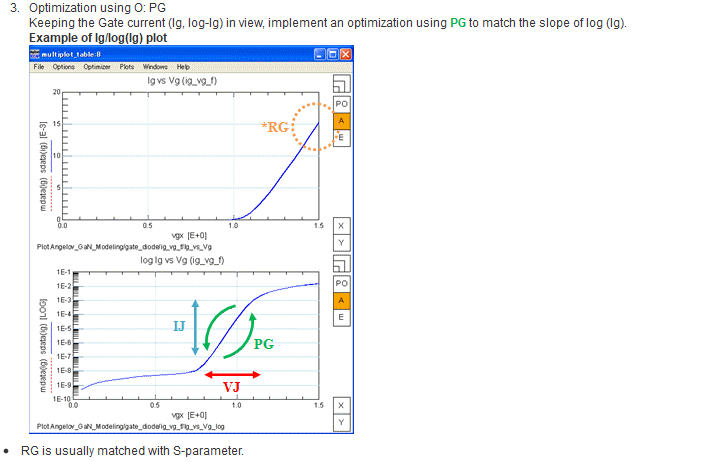

   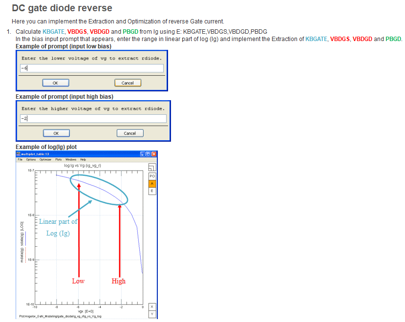

   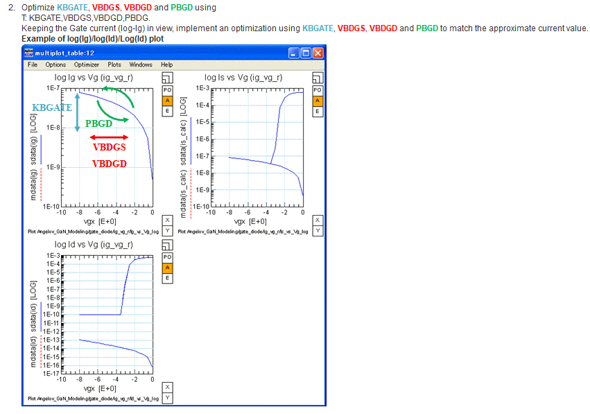

5. idvg & idvd

   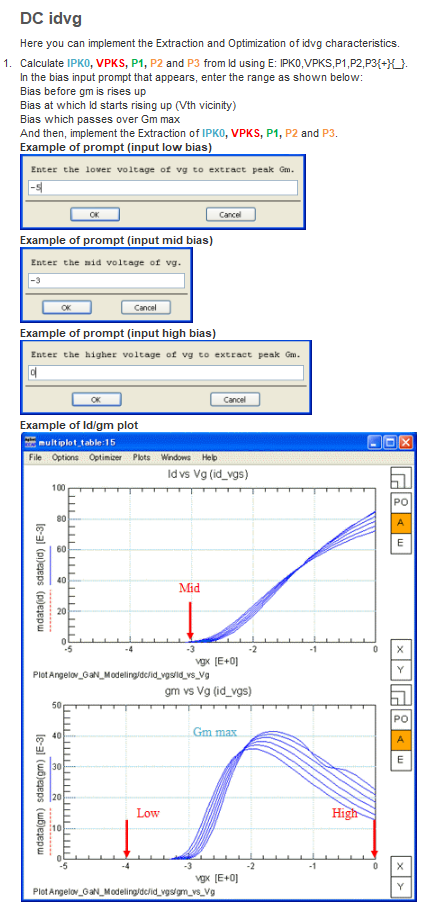

   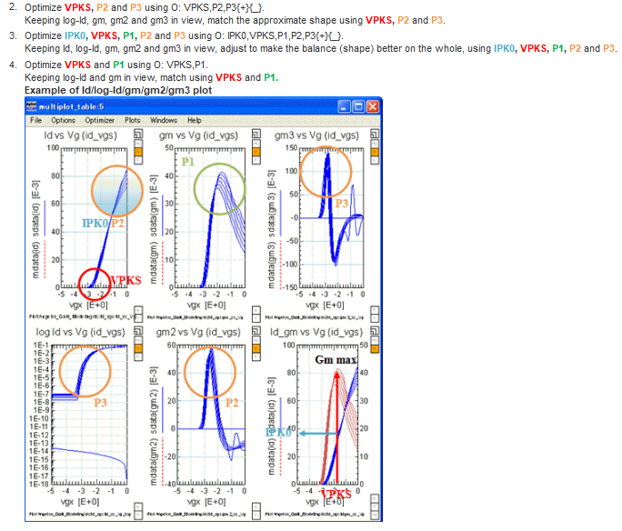

   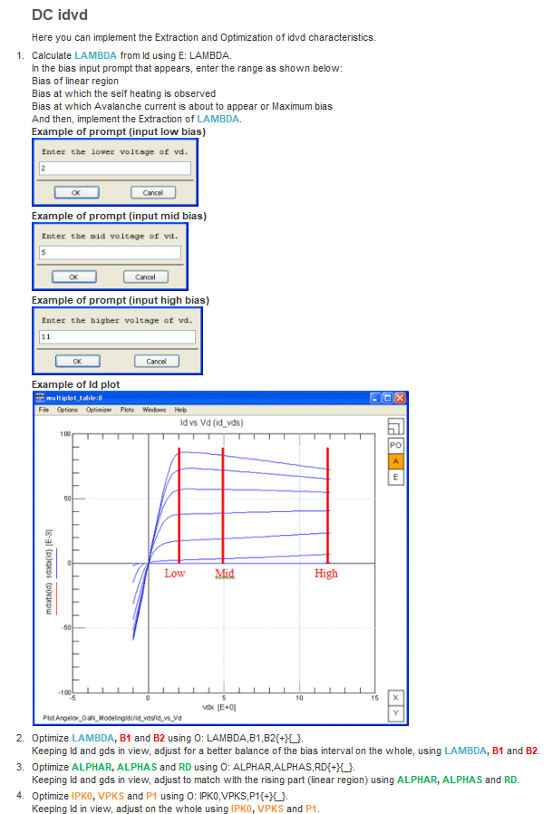

   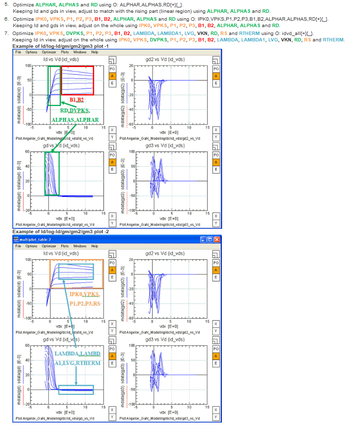

   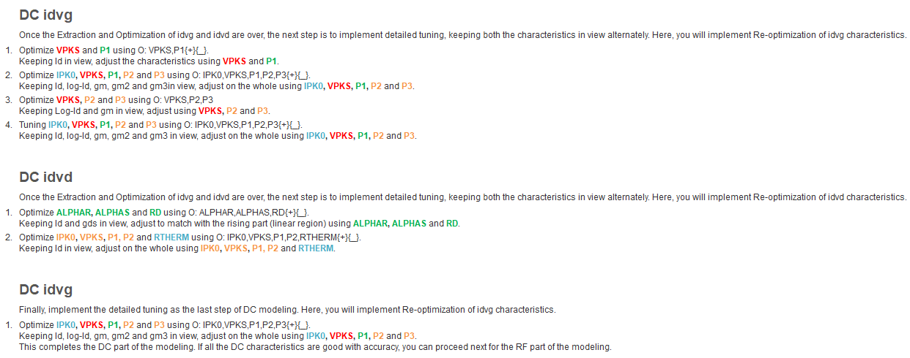

6. SP

   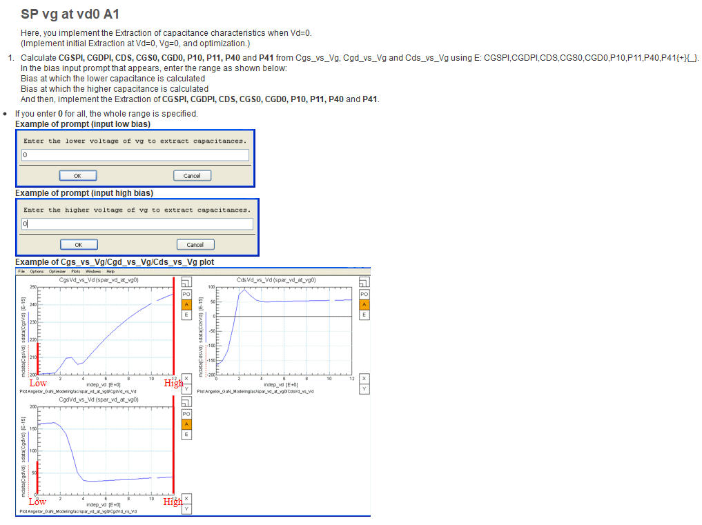

   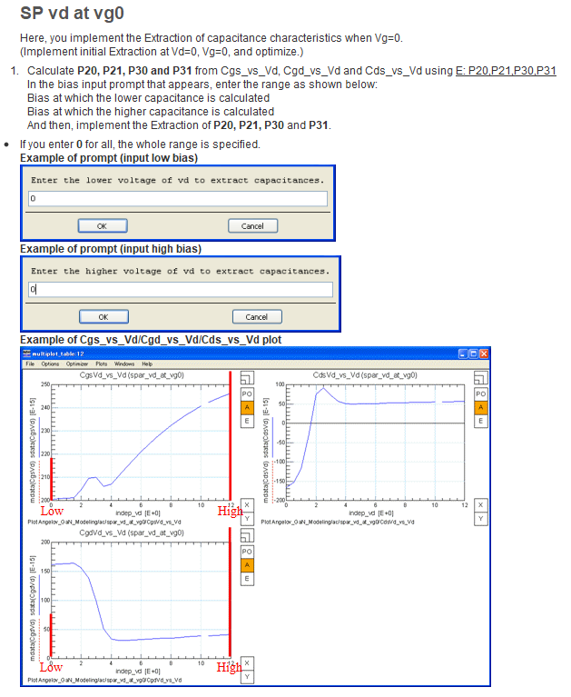

   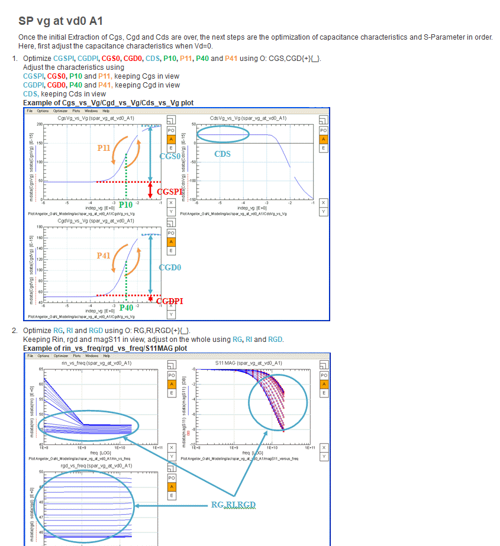

   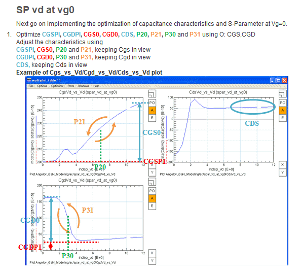

   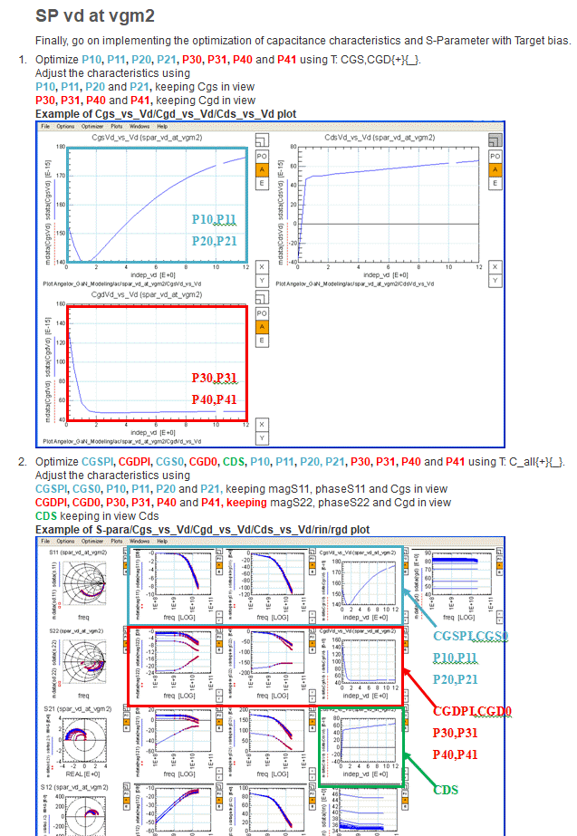

   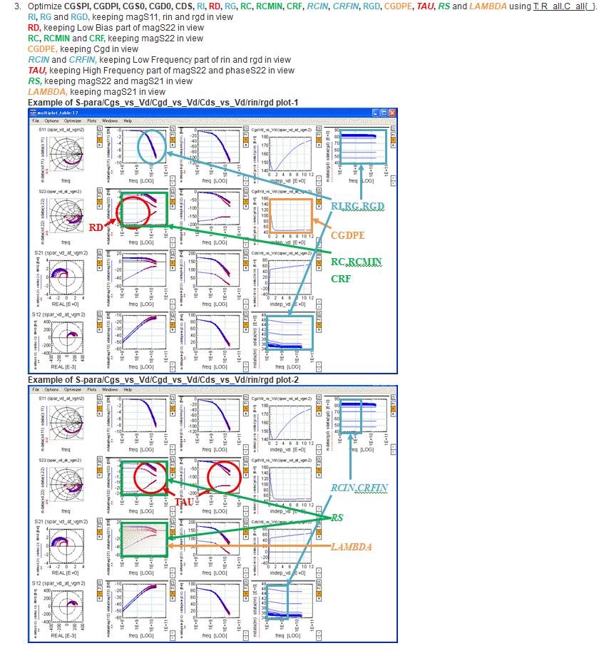

   

### ==Mindmap for Trouble Shooting==

### ==Hand-Scripts of Angelov Model Parameter Extractions==

[Back to Table of Contents](#Characterization and Modeling of GaN HEMT)

## ==Reference==

[Back to Table of Contents](#Characterization and Modeling of GaN HEMT)
