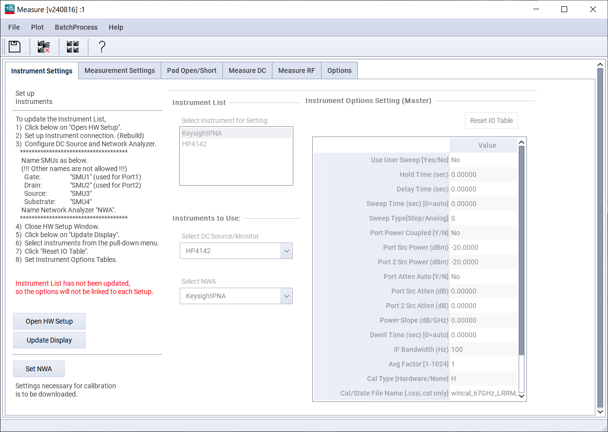

# Characterization and Modeling of GaN HEMTs

<center>Tianyang (Eliot) Chen | Advisor: Patrick Fay | 2024 Summer</center>

> *Click the hyperlink in the table of contents to navigate to the corresponding section.*

[TOC]

## Introduction

### Overview

#### About this Work

In this work：

- 我们学习了GaN HEMTs的基本概念，对于Angelov GaN Model的理论进行了学习与分析；
- 我们对于UltrabandTech提供的GaN HEMT样本，使用IC-CAP设计并完成了基于测量的characterization workflow;
- 我们总结了Angelov GaN的模型参数，使用ICCAP和MATLAB对模型参数进行了提取；
- 我们利用参数在ADS中构建了模型，进行优化使之与器件character更fit，致力于将器件应用于电路设计。

#### About this Documents

这是本次暑期科研项目的总结性文件。我将从以下三方面介绍本次科研的工作：

- 基本概念和情况的Introduction；
- characterization的具体过程；
- 基于提取参数、仿真和优化的modeling过程；

本次假期做出了很多尝试，遇到了很多挫折。我在本文中将我所有获得的经验记录下来。
内容较多，为了避免迷失，以下是本文的思维导图：


#### Releases and Updates

本片文章和项目中产生的其他文档，我将开源在我的GitHub仓库。


<center>https://github.com/EliotChen8/Characterization-and-Modeling-of-GaN-HEMTs</center>

对内容的releases and updates，请同样关注以上链接。


### Gallium Nitride (GaN) High-Electron-Mobility Transistors (HEMTs)

#### Concepts

HEMT是一种采用异质结构设计的场效应晶体管，利用两种不同半导体材料的界面的势阱中产生的二维电子气（2DEG）通道，实现高速电子传输和低电阻特性。


GaN HEMT是一种基于氮化镓材料的HEMT，其优势包括更高的击穿电压、更大的功率密度和更优的高温性能，适合应用于高频和高功率电子设备。

#### Modeling Techniques

这一部分将主要介绍目前常见的三类针对GaN HEMT的建模方式，并且分析其优缺点。
这一部分说明了为什么我们需要在本次项目中采用Angelov GaN模型。

由于GaN HEMT具有卓越的性能优势，对其进行有效的建模显得尤为重要——建模不仅是连接器件特性与其在实际应用中性能的桥梁，而且也是电路设计和系统集成的基础。在GaN HEMT的模型发展历史中，主要演化出了以下几类。

- **Physics Based Models:** 经验模型侧重于通过选择和组合数学函数，来数值上拟合模型行为与测量数据的匹配，这些函数通常没有物理解释。经验模型的优势在于计算效率高，易于在电路仿真器中实现；劣势是缺乏对器件物理行为的解释，且参数提取耗时且需经验丰富的建模者。经验模型适用于快速评估并仿真新设备的性能，特别是在电路和系统层面，但不适合从设备角度优化电路性能。

- **ANN Based Models:** 神经网络模型，比如DynaFET，采用神经网络方法，通过使用经验模型进行过渡并进行建模，以适应各种偏压、负载和频率条件下的仿真需求。神经网络模型的优势在于在大信号波形测量和模型训练方面取得了良好的效果；劣势是但耗时且对算力消耗大，缺乏物理解释，可以说继承了经验模型的所有限制。神经网络模型适用于需要广泛偏压和负载条件下的DC、S参数、谐波及互调失真和负载拉动仿真的场景。

- **Empirical Models:** 基于物理的模型根据半导体物理（如材料特性和载流子运动）来分析器件行为的原因，使用的参数较少且具有明确的物理意义。其优势是提供了从量子物理到器件物理级别的明确解释，有助于器件与电路的交互式设计；劣势是需要特殊的数值算法来解决开放形式的模型方程，计算密集。适合那些需要从基础物理原理出发进行电路设计和优化的应用，但需要详细的器件过程信息。

在领域内常用的模型如下所示：


在本次暑期科研项目中，我们选择采用Angelov GaN模型，主要是因为这种模型能够在不完全掌握设备详细物理信息和结构的情况下，依旧能够提供对GaN HEMT的有效建模。考虑到项目周期短且无法获得厂家的详细器件信息，经验模型，特别是Angelov GaN模型以其较高的characteristic和modeling效率，成为了一个合适的选择。


### Angelov Model

#### A Brief Review

这一部分将介绍本次文献调研的基本情况，着重介绍提出Angelov模型的论文。

Angelov 模型是 Iltcho Angelov 教授于 1992 年首次针对 GaAs MESFET 和 HEMT 提出的经验模型，后来扩展到 GaN HEMT 作为 Angelov-GaN 模型。

Angelov模型的核心方程包括描述漏极电流、栅极电流和非线性电容 (Cgs、Cgd、Cds) 的方程。对漏极电流、栅极电流和非线性电容的观察表明，它们相对于栅极电压通常呈现双曲正切形状，而跨导呈现钟形形状，因此选择tanh(x)函数作为核心经验拟合函数。

漏极电流通过 VGS 相关项和 VDS 相关项的乘积进行建模，如下所示
$$
I_d = I_{pk0} \left( 1 + \tanh \phi \right) \tanh \left( \alpha V_{ds} \right) \left( 1 + \lambda V_{ds} \right)
\\
\alpha = \alpha_r + (1 + \tanh \phi) \alpha_s
\\
$$
Ipk是对应于最大跨导 gmpk 的偏置下的漏极电流。 λ 是模拟漏极诱导势垒降低的系数。 ψ 被建模为峰值 gm 点处的幂级数，如下所示：
$$
\phi = P_1m (V_{gs} - V_{pks}) + P_2 (V_{gs} - V_{pks})^2 + P_3 (V_{gs} - V_{pks})^3
$$
Vpk 是最大 gmpk 的栅极电压。这里添加了更多经验拟合参数（P1、P2、P3 ...）来拟合栅源电压依赖性。其中P1的提取近似地可以用器件的特性来直接计算：
$$
P_1 = \frac{g_{mpk}}{I_{pk} (1 + \lambda V_d)} \approx \frac{g_{mpk}}{I_{pk}}
$$
基于本模型，高频属性通过以下方程将非线性电容与测量电容进行经验拟合来建模
$$
C_{gs} = C_{gspi} + C_{gs0} (1 + \tanh \phi_1)(1 + \tanh \phi_2)
\\
C_{gd} = C_{gdpi} + C_{gd0} (1 + \tanh \phi_3)(1 + \tanh \phi_4)
$$
这里引入更多拟合参数来拟合电容模型：
$$
\phi_1 = P_{10} + P_{11} V_{gs}
\\
\phi_2 = P_{20} + P_{21} V_{ds}
\\
\phi_3 = P_{30} + P_{31} V_{gs}
\\
\phi_4 = P_{40} + P_{41} V_{ds}
$$
Angelov-GaN 模型基于大量的拟合参数，该模型能够捕捉一部分的器件特性。然而，大量参数测量和提取过程相当具有挑战性。 I-V 方程中拟合参数（例如上面显示的 P 和 Φ 的集合）的独立性可能会导致模型的拟合在一定程度上脱离实际意义。

与此同时，Angelov模型不基于物理。尽管模型构建无法为设备工程师或电路设计人员提供物理见解，且对设备进行的任何工艺或几何形状更改都需要重新拟合模型。但对于本次暑期科研，我们没有从厂商得到该器件的物理属性信息。

总体来说，Angelov 模型是实用、简单、准确的大信号经验模型，能够对漏极电流-栅极电压特性及其导数以及电容进行有效拟合。因此，Angelov模型已被广泛应用于 HEMT 和 MESFET的建模。被用于预测器件的直流参数和 S 参数，并以良好的精度模拟不同非线性电路（如混频器和乘法器）的性能，有利于将器件运用于实际的电路设计当中。

综上所述，使用Angelov模型进行拟合对于本次暑期科研来说是具有合理性的。

#### Developments

这一部分将介绍这一模型的逐渐发展—最终成为商业simulator的常用模型的过程。

在文献综述中，Angelov模型主要经历了以下的发展：

1. **1992**："A New Empirical Nonlinear Model for HEMT and MESFET Devices"文中，Iltcho Angelov等人首次提出了Angelov模型。文章提出了一种新的大信号模型，能够模拟HEMT和MESFET的I-V特性及其导数，包括特征跨导峰值和电容。这一模型的参数提取直接且有效，已成功应用于各种亚微米栅长的HEMT设备，包括不同掺杂的伪异质结HEMT、晶格匹配的InP HEMT以及商用的MESFET。该模型研究了下图中的PM2 HEMT，为其构建了等效电路模型，并进行了测量和仿真；

   

2. **1996**："Extensions of the Chalmers Nonlinear HEMT and MESFET Model"文中，Angelov等人扩展了Chalmers非线性模型，增加了模拟温度、色散和软击穿效应的能力。这一扩展允许模型更准确地预测不同制造商的商业HEMT和MESFET设备在17-400 K温度范围内的行为。文章基于模型对HEMT优化了等效电路模型，并进行了参数提取和仿真分析；

   

3. **2005**："On the large-signal modelling of AlGaN/GaN HEMTs and SiC MESFETs"文中，Angelov等人发展了一个适用于GaN和SiC FET设备的通用大信号模型。该模型提高了谐波管理能力，提供了对色散的更物理化处理，同时模拟了这些设备中的其他特定效应。这一模型在仿真工具中得到了实现，并在DC、S和大信号测量中展示了良好的准确性和稳定性；

   

4. **2007**："Large-Signal Modelling and Comparison of AlGaN/GaN HEMTs and SiC MESFETs"文中，Angelov等人进一步改进了针对GaN和SiC FET设备的大信号模型，特别注重提高谐波分析和提供对色散的物理化处理。这一改进使模型在商业仿真工具中的表现更加准确；

5. **2010**："On the Large Signal Evaluation and Modeling of GaN FET"文中，Angelov等人扩展了GaN FET的大信号模型，包括偏置和温度依赖的接入电阻，修改了电容和电荷方程，以及新增了击穿模型。这些改进进一步提高了模型在仿真工具中的整体准确性。

   

6. **近几年**：一系列论文中继续优化Angelov-GaN模型，尤其是对于小栅长和栅宽的GaN HEMT。这些研究通过参数分析扩展了标准DC模型，为RF建模使用开短路de-embed来捕捉pad寄生效应，使模型在DC I-V Curve和S参数上与实验数据更加吻合。

   


#### Angelov GaN Model

本次项目基于Keysight发行的GaN HEMT model开展研究：


### Integrated Circuit Characterization and Analysis Program (IC-CAP)

IC-CAP一个由Keysight Technologies开发的软件，用于半导体器件的建模和特性分析。

#### Designed Workflow

这一部分介绍本次的Modeling Package，以及软件自身包含的整个提取项目的workflow。

本次项目的测量和基础数据采集使用IC-CAP自带的Angelov GaN model，
路径为`ICCAP/examples/model_files/hemt/angelovgan`，

模型设计的工作流程如下：


[Back to Table of Contents](# Characterization and Modeling of GaN HEMTs)

<div STYLE="page-break-after: always;"></div>

## Characterization

这一部分将讲述如何进行基于测量的Characterization，我将会详细介绍如何针对我们的器件来进行设置，介绍如何根据器件的基本信息设置具体的测试流程，并在尽可能确保器件安全的前提下完成测量。

这一部分的帮助文档介绍比较详细，我们可以阅读帮助文档来指导我们的实验。这一部分我将会主要介绍帮助文档没有具体讲解，或者与DUT自身属性相关性较强的内容。

### Settings

#### Device Settings

这一部分将介绍如何基于器件的基本结构对于项目进行设置。

这一部分比较主要的内容是对于Gate Width和Gate Finger的个数进行录入，这取决于器件本身。这一过程并不会直接影响测量与参数提取，但是有利于让建立的模型对设计有更强的指导性意义。

对于本次实验，我们测量的是 UltrabandTech 的 GaN HEMT，其Walfer No. 为 1R


我们可以将器件参数录入到IC-CAP当中：


#### Instrument Setting

这一部分将介绍本次实验选用的测量仪器，并介绍如何通过IC-CAP与仪器进行通信。

进入IC-CAP的Measure步骤，这可能看起来会有一些混乱：



但是在正式测量开始前，我们只需要确定我们需要使用哪些仪器，仪器的量程能够覆盖器件测试的需求，并确保我们计划使用的仪器能够与我们的电脑正常通信。

本次实验：


- 基于Linux的IC-CAP 2021程序；

- 使用HP4142作为DC的测量平台，其支持40uV-100V的电压偏置和20fA-100mA的电流供应，可以作为Force，也可以作为Sense，满足器件需求；
- 使用KeysightPNA作为RF的测量平台，支持最高110GHz的网络分析，本次的HEMT工作在28GHz，满足器件需求。

在确定使用的仪器后，我们可以尝试用电脑与仪器之间进行通信。通常情况下，Linux终端可以直接连接。但是Windows终端可能有所不同。此时我们可以下载Keysight Connection Expert，完成默认配置后我们便可以实现IC-CAP和测量仪器的通信。


### Measurement Flow Design

#### Pilot Experiments

虽然我们的目标是测试测量器件的属性，但是在设计测量流程开始之前，我们不能对其一无所知。

对于本次实验，在测量开始之前，我们在预实验中得到了器件的IV-Curve：


不过这里有非常有趣的一个发现：预实验的结果可能会和最终实验的结果相差很大。例如在这个预实验中，我们可以观察到很明显的kink effect，但在最终本次测量得到的结果中这个effect并不明显。我们猜测这可能是以下几个原因导致的：

- 两次测试使用了不同的仪器；
- 在正式实验中，我们施加了负向Vd，这可能在一定程度上缓和了kink effect。

总而言之，预实验只是我们初步了解器件特性的一个信息来源，我们可以依据预实验来初步设计测量setup，但也不应该过度相信初步结果。

#### Measurement Setting

这一部分将介绍如何对测试的基本信息进行设置，包含了对校准的设置、对测量限制的设置、和对于提取频率的设置。


在这一步中，我们需要完成五步设置：

1. 温度：

   尽管我们本次只测量器件在室温下的特性，但是软件会默认拥有一个温度列表。我们需要做的是将温度列表中的项目尽可能减少，只需要保留Tnom（25℃）和另一个即可。在之后参数提取的过程中，我会讲解如何让软件在只测量室温的情况下运行。

2. Compliance pre-setting：

   这一步非常重要，是保护我们器件安全的第一道防线。

   我们可以根据预实验中测得的电流和电压来设置这一系列参数。值得注意的有几点：

   - 当我们的setup是测量电压时，电流compliance生效，反之亦然；
   - 这里设置的是绝对值，例如当我们想扫描-3~0V时，我们需要设置电压的compliance为3；
   - 在设置好compliance后，我们可以直接在后续的步骤中选择维持这一compliance来同步数据，我们也可以通过输入新的数据来override默认值，但请注意，这一步包含一定风险。

   对于source和substrate的compliance，针对GaN HEMT的测量场景，我们直接维持drain的设置即可。

3. 扫频：

   这一步可以适当扩大扫频的范围，这可以说明我们的模型可以在更宽的频率范围内工作。

4. 单点频率：

   这一步很重要，这决定了之后测量器件极间寄生电容和电阻的频率选定，将会在很大程度上影响S参数的测量数据提取和fitting。

   我们可以参考以下叙述进行设计：

   

   值得注意的包括以下两点：

   - 这一步的频率必须选择扫频matrix中已经存在的频率
   - 这一步的频率选择与基于cold FET寻找测量结果flat range的思路不同，请勿混淆；
   - 由于掌握的信息有限，我们可能不能在第一次直接测量到对的值，我们需要在多次实验中寻找反馈。

#### Pad Open/Short

这一部分介绍了对于Open和Short Pad的测量，这一步将被应用于De-embed计算。


在设计阶段，我们并不需要担心太多，只需要注意以下两点：

1. 确保温度matrix和上一步中相同
2. 确保频率matrix和上一步中相同

#### DC Setups

这一部分介绍DC测量的一系列setups，并基于本次的测量说明测量设计的思路。

在DC的测量中，主要包含了4组、11个Setups：

- Port R Bias: 分别在两个端口上加电流，测量电压，计算端口电阻。

  1. Bias_R1_wRT: 测量Short ISS条件下的Port 1；

     

  2. Bias_R2_wRT: 测量Short ISS条件下的Port 2；

     

- Gate Diode: 测量Gate Diode的物理属性，这一步可以通过在预实验中观察开启电压来预测，在实际测试中，我们可以再根据测量结果进行灵活调整。

  3. ig_vg_f: gate二极管正向特征，主要关注开启到饱和的区域，测量Vg增大过程中Ig逐渐导通的过程。具体而言，我们需要Sweeps until the resistance component is seen in bias，也就是观察Log Ig关于Vg的曲线在高电压处变得平缓。

     

     为了防止烧毁器件，我们在设计setup的过程中应该遵循如下思路：

     

     - 确保Vd接近于0；
     - 维持相对保守的Vg策略，并做好根据测量进行调节的准备；
     - 先沿用通用的compliance，准备根据测量结果放宽compliance。

  4. ig_vg_r: 测量二极管的反向特性：

     

     这一步相对简单，只需要观察漏电，不要施加过大的负向电压导致击穿即可。

- IV-Curve: 最基本且重要的测量；

  5. id_vgs：需要测量出gm不断增大的过程，一直sweep，直到gm随着bias开始下降的时候：

     

  6. id_vds：最经典的IV-curve，但是需要扫描到自热，也就是高vds处的曲线开始向下倾斜：

     

- Targeted: 针对器件预期的工作区域进行有目的的单独测量；

  7. id_vgs_vg_neg：测Id和gate反向电流的关系

     

  8. id_vgs_tgt：要测在target直流偏置下的id和vgs

     对于本次测量，目标就是vd在5-25V之间器件相对稳定的工作区域

     

  9. id_vds_low:测在Vd很小时候的特性，要尽可能测反向偏置，但是小心损坏器件

     

     

  10. id_vds_high: 测id大电流，将Vg控制在目标工作区，然后尽可能加大Vds，小心击穿器件

      

      

  11. is_vds_tgt:测目标偏置下的特性，如不确定目标，可以沿用之前不考虑目标时候的设置

      

在DC的测量中，还有可要注意一些细节：

1. 当DC测出来噪声很大，关闭MWA再试试；
2. 根据教授经验，所有的测量需要依次进行。但对于有较大破坏性可能的实验，可以最后再测；
3. 选择好的时机截取数据；

#### RF Setups

这一部分介绍DC测量的一系列setups，并基于本次的测量说明测量设计的思路。

> 根据参数提取过程中得到的结果，这一部分的测量设计可能存在问题，请谨慎看待。

- Cold FET：

  1. spar_0V：当Vgs，Vds都是0的时候测量S参数

     

- spar_vg_at_vd0：维持Vds=0并调整Vg

  2. A1：pinch offf 区域的特性

     

     

  3. A2：关闭区域的特性

     

     

  4. A3：开启区域的特性

     

     

- spar_vd_at_vg：设定Vg在特定值，扫描Vd全域

  5. 0：设置Vg=0

     

  接下来三项测量需要取决于Vg开始的特性：

  

  我们观察到Linear的电流从vg=-1.75处开启，关闭与明显提升的点分别在-2和-1.5.

  5. gm1：

     

  6. gm2：

     

  7. gm3：

     

- spar_vg_vd：固定频率在提取电容的点，Vd维持在高点，根据A1-A3的设置调节Vg

  9. vd1：

     

     

  10. vd2：

      

      

  11. vd3：

      

      

- spar_vg_vd：

  12. FC1：在FC1测量关于全域Vd和全域Vg的S参数

      

  13. FC2：在FC2测量关于全域Vd和全域Vg的S参数

      

- spar_i

  14. spar_i：Drawing 1/2 of the current flowing from gate side into the drain side and measuring S

      


### Measurements with Risk Managements

这一部分将介绍如何利用上述构建出的程序，对于器件开展测量。

> 测量的过程就像是人生，
> 最安全的方式是待在家里永远不出去，
> 但是这样我们不会有任何收获。

在测试器件的过程中，我们难免会施加一些相对严格的条件，这是一个高风险高回报的过程。
当然，我们可以进行风险和收益的trade off，从而在更安全的范围内得到更有效的数据。

> 但是，我们必须永远保持敬畏之心，
> 不要像曾经的我一样, like a bull in a china shop.
>
> 我曾经太自信，没有给予实验室的仪器足够的尊重，
> 以至于我搞砸了整台设备，差一点就把整个暑期科研全搞砸了。
> 这篇文章也差点到此为止。
>
> 
>
> 但是，我没有放弃：
>
> - 我学会了敬畏，学会了become a learner before a researcher;
> - 我尽最大的努力，用一切的方法继续我的工作进度；
> - 我学会了面对突发事件和情绪波动，和教授与同事有效沟通。
>
> 最终，我在这场灾难中得到了前所未有的成长。

#### Instrument Setups

这一部分将介绍仪器和测试端口的连接。

在测量开始前，我们需要确保仪器已经正确的与电脑进行通信：


1. 检查电脑与repeater的物理连接，本次实验使用GPIB进行连接；
2. 检查电脑能够正确扫描到相对应的设备；

连接正常后，我们需要进行名称和端口的配置：

1. 对于DC：
   1. 测量仪器端口的硬件名称可能和实际名称不一样，我们只需要将硬件名称对应的代称改为SMU1和SMU2即可；
   2. 将被设置为SMU1的端口使用线缆连接至Port1，SMU2同理。
2. 对于RF：
   1. 将网络分析仪命名为NWA；
   2. 虽然帮助文档上要求我们在此时完成Set NWA，但事实上这一步的功能是将IC-CAP中的设置同步到NWA之上，不用为此感到疑惑。

最终，我们需要连接仪器与探针平台，在这一步我们需要注意：

1. 请确保将SMU1-Port1连接到Gate；
2. 请确保将SMU2-Port2连接到Drain；
3. 请不要给Source连接SMU，这可能会导致测试结果异常；
4. 对于GaN HEMT，Substrate是绝缘的，直接接地即可。

#### Measurement Settings

这一步将介绍对测试的设置，主要是RF测试的校准。


本次实验使用的NWA不能使用Linux终端进行校准，因此我们使用Windows终端进行校准后，直接将校准结果作为文件进行输出。这份校准文件被收录在模型文件同路径的测量结果文件夹下。

完成校准后，我们选择Set NWA，将IC-CAP的测量设定上传至NWA。

这里需要注意的有两点：

1. NWA的校准相当敏感，请在完成校准的12小时内完成测量；
2. 在这一步，我们可以先执行DC的前两个Setup，即测量SHORT ISS以提取端口电阻；
   这可以让我们减少一次对探针的移动，大大降低风险。

#### Pad Open/Short and De-Embed Calculations

这一步将介绍对于Pad测量的基本情况。

在本次实验中，wafer上没有构建用于校准的Pad。因此，我们采用另外一个样本上的Pad来作为代替：


但这里存在两点隐患，可能会对de-embed的结果引入误差：

1. 这个wafer上不包含2x50的pad，最接近的是2x37.5，我们只能测量这个；
2. 这不是同一个sample上的pad。

完成这一步之后，如果我们已经如上一步所叙述，完成了对端口电阻的测量，我们便可以将探针扎入我们的样本，正式开始测试，此后不需要抬起探针。


#### Measurements

这一步将介绍如何运行测量的setup，并根据结果调整测量参数。由于之前已经详细讲解了setup，我只针对测量过程中容易发生风险，和需要调整，还有需要注意的点进行论述：

- ig_vg_f：

  在实际测试过程中，ig设置的2mA compliance完全不够用，在2.5V的测试中，我们也没有看到resistant component的迹象；

  为了获得有效数据，我们先将电压提升至3V，然后逐渐放宽compliance。我们在将compliance调整至10mA的过程中，我们在log曲线中观察到了resistant component：

  

  尽管此时曲线依然存在因为compliance局限导致的失真，但是根据教授的意见，我们选择直接采用这个数值而不是继续测量—我们已经得到了有效的信息，且继续测量的风险太大了。

  在仿真过程中，从这里输出的数据直接输入数据提取函数会出现问题。我们需要手动修改参数，具体而言就是下文中将会介绍的Ij。

- ig_vg_r：

  在这一步中获得的数据噪声较大：

  

  但根据PhD学长的建议，我们不能要求实际测试和仿真一样理想，因此这个数据是可以接受的。

- 针对RF测量，有一系列数据与Demo项目中呈现的曲线走势不同，
  我们正在寻找原因——到底是因为器件本身性质的不同，还是测量Setup的设计存在问题。


[Back to Table of Contents](# Characterization and Modeling of GaN HEMTs)

<div STYLE="page-break-after: always;"></div>

## Modeling

### Angelov GaN Parameters

#### All Parameters

使用 Angelov GaN 进行建模，我们需要提取一系列参数。
对于simulator来说，所有的参数已经定义好并完成了初始化。

对于本次项目中使用的模型，所有参数的名称，定义和默认值，请见[Appendix 4.1](### Keysight: Angelov-GaN Parameters Definitions and Default Values)

#### List of Significant Parameters

并非所有参数都将对最终的仿真结果产生实质性影响。同时，由于ICCAP和ADS使用的仿真器版本不一定一致，有相当一部分参数将在ADS的仿真器中出现，但是并不会被ICCAP所提取。不过幸运的是：经过测试，这一系列参数基本不会对最终的fitting结果产生实质性影响。

对于将会对仿真结果产生实质性影响，且支持从ICCAP中进行提取的参数，我整理如下：

> 根据参数的类型和对最终结果的影响，我将参数分为以下三组；
>
> 对于每个参数，基于本次项目中获得的经验，主要有三种获取信息的来源：来自ICCAP的计算，来自manual提取参数的程序，和根据fitting结果的tuning。在表格中，我分别用ICC, MAN, TUN代表信息的来源，其中1代表该参数信息可以在这一过程中获取。

DC Characters and Polynomial Coefficients:

| Parameter | Definition and Description                                   | ICC  | MAN  | TUN  |
| --------- | ------------------------------------------------------------ | ---- | ---- | ---- |
| Ipk0      | Value of drain current (id) at maximum transconductance (gm) | 1    | 0    | 1    |
| Vpks      | Gate voltage (Vg) at maximum transconductance (gm)           | 1    | 0    | 1    |
| Dvpks     | Change in gate voltage at peak transconductance              | 0    | 0    | 1    |
| P1        | Polynomial coefficient for channel current at peak gm        | 0    | 1    | 1    |
| P2        | Polynomial coefficient for channel current                   | 0    | 0    | 1    |
| P3        | Polynomial coefficient for channel current                   | 0    | 0    | 1    |
| Alphar    | Saturation parameter alpha r                                 | 0    | 0    | 1    |
| Alphas    | Saturation parameter alpha                                   | 0    | 0    | 1    |
| Lambda    | Channel length modulation parameter                          | 0    | 0    | 1    |
| Lambda1   | Channel length modulation parameter                          | 0    | 0    | 1    |
| Ij        | Gate forward saturation current                              | 0    | 0    | 1    |

Capacitance Parameters and Polynomial Coefficients:

| Parameter | Definition and Description             | ICC  | MAN  | TUN  |
| --------- | -------------------------------------- | ---- | ---- | ---- |
| Cds       | Zero-bias drain-source capacitance     | 1    | 0    | 1    |
| Cgspi     | Gate-source pinch-off capacitance      | 1    | 0    | 1    |
| Cgs0      | Gate-source capacitance parameter      | 1    | 0    | 1    |
| Cgdpi     | Gate-drain pinch-off capacitance       | 1    | 0    | 1    |
| Cgd0      | Gate-drain capacitance parameter       | 1    | 0    | 1    |
| Cgdpe     | External gate-drain capacitance        | 1    | 0    | 1    |
| P10       | Polynomial coefficient for capacitance | 0    | 1    | 1    |
| P11       | Polynomial coefficient for capacitance | 0    | 1    | 1    |
| P20       | Polynomial coefficient for capacitance | 0    | 1    | 1    |
| P21       | Polynomial coefficient for capacitance | 0    | 1    | 1    |
| P30       | Polynomial coefficient for capacitance | 0    | 1    | 1    |
| P31       | Polynomial coefficient for capacitance | 0    | 1    | 1    |
| P40       | Polynomial coefficient for capacitance | 0    | 1    | 1    |
| P41       | Polynomial coefficient for capacitance | 0    | 1    | 1    |

Resistance and Inductance Parameters:

| Parameter | Definition and Description | ICC  | MAN  | TUN  |
| --------- | -------------------------- | ---- | ---- | ---- |
| Rg        | Gate resistance            | 1    | 0    | 1    |
| Rd        | Drain resistance           | 1    | 0    | 1    |
| Rs        | Source resistance          | 1    | 0    | 1    |
| Ri        | Input resistance           | 1    | 0    | 1    |
| Rgd       | Non-ohmic gate resistance  | 1    | 0    | 1    |
| Lg        | Gate inductance            | 1    | 0    | 1    |
| Ld        | Drain inductance           | 1    | 0    | 1    |
| Ls        | Source inductance          | 1    | 0    | 1    |


### IC-CAP Extraction Flow 

#### Extraction Flow Overview

这一部分将介绍IC-CAP软件原生设计的参数提取流程。


具体而言，整个流程主要分为7个大的部分，每个部分包含着软件中显示的extraction setup，在这些setup当中，我么可以的得到我们需要的参数，具体情况如下所示（对于提取出核心参数的步骤进行了加粗）：

1. **Initialize:**
   1. Reset Parameter to Defaults:
   2. Initialize Parameter and Boundaries for Extraction:
   3. Update All Measures Data for Extraction:
2. **Port Res:**
   1. **PreDC Port1: Z1;**
   2. **PreDC Port2: Z2;**
3. **Cold FET:**
   1. **SP Cold FET: Rg, Rd, Rs, Lg, Ld, Ls;**
4. **Gate Diode:**
   1. DC gate diode forward:
   2. DC gate diode reverse:
5. **DC idvd & idvg:**
   1. **DC idvg: Ipk0, Vpks**
   2. DC idvd:
   3. DC idvg:
   4. DC idvd:
   5. DC idvg:
6. **SP vg & vd:**
   1. SP vg at vd0 A1: 
   2. SP vg at vg0:
   3. **SP vg at vd0 A1: Cgs0, Cgspi, Cds, Cgd0, Cgdpi, Ri, Rgd;**
   4. **SP vg at vg0: Cgs0, Cgspi, Cds, Cgd0, Cgdpi**
   5. **SP vg at vgm2: Cgdpe**
7. **Finalize:**
   1. Save Parameters:

当然，这个流程不是完美的，尤其是在拟合过程中将会出现大量error。根据我的测试，软件中自带的extract flow甚至不能完整运行自带的demo程序，且debug过程相当复杂。

根据与教授的沟通，教授告诉我软件并不是万能的，我们应该以软件作为自己的启发，但回归论文寻找更清晰的答案。因此在本次工作中，我们的目的是：

1. 能够完整的运行整个extract flow；
2. 使用IC-CAP计算了一部分参数；
3. 之后，我们会基于这些参数和论文中的定义来手动提取剩余的参数；
4. 最终，根据ADS的tuning结果来得到所有参数。

#### Debugging

这一部分将介绍实际运行Extraction Flow之前的debug过程。

如果使用软件自带的程序，由于其必须要提取一系列温度敏感性相关的参数，系统会强制要求测量两个温度下期间的character。具体而言，软件会禁止我们选择shrink list。


但是本次暑期科研的测试平台只支持测量室温一个温度下的数据，这和软件产生了冲突。

在参数提取过程中，这个问题会被体现出来。具体而言，软件在初始化过程中会中断，并禁止我们继续进行参数提取，这将使我们完全不能从IC-CAP当中提取所有参数。

为了解决这一问题，我们可以进行以下操作

- 选中室温（Tnom）下的测试数据，并导出；
- 选中另外一个温度的对应setup，导入室温下的数据；
- 请不要忘记：在这一步选择Copy Tnom Settings，否则程序将会依旧无法运行。

此时运行测试流程，程序将可以运行，运行中主要会出现三种报错：

- 优化函数显示 Data Unchanged，这是相对正常的，说明拟合结果已经达到了最好；
- 优化函数中断并显示仿真器出错，这是相对难以处理的问题。我们可以选择从上一步重新运行，大多数情况下这一种错误将会消失；
- 在terminal的output显示较大误差，且数据不变，这种情况需要分类讨论：
  - 如果是参数触及了仿真前设置的极限，可以尝试调整极限；
  - 但是绝大多数情况下，函数就是不工作；
    事实上，我曾经花了一个星期来研究这个问题，但是没有得到一个明确的答案；
    也正是在此时教授提醒了我，让我不要盲目相信这个软件。


### Parameter Extractions

#### IC-CAP Data Output

这一部分将总结所有从IC-CAP当中读取的参数。

关于这些参数的定义，请查阅上文的所有参数列表，或significant parameter的列表。这一部分主要结合ICCAP的数据提取这些参数。

以下是所有参数的读取过程：

DC Characters and Polynomial Coefficients:

- Vpks: -0.1

  gm峰值位于-0.1~0之间

  

- Ipks: 0.033

  读取-0.1时候的电流值

  

Capacitance Parameters and Polynomial Coefficients:

- 根据帮助文档：

  

  我们得到以下结果：

  

  - Cgs0: 83;
  - Cgspi: 88;
  - Cds: 29;
  - Cgd0: 53;
  - Cgdpi: 44;

- 再根据帮助文档：

  

  我们针对相同的参数组合又得到了结果：

  

  - Cgs0: 20;
  - Cgspi: 150;
  - Cds: 20;
  - Cgd0: 93;
  - Cgdpi: 5;

  令人担忧的是，这三个曲线并不符合帮助文档中呈现的趋势。

- 最终根据帮助文档：

  

  观察测量结果：

  

  Cgdpe:5.2;

Resistance and Inductance Parameters:

- 根据帮助文档，这一部分的数据主要来源于 Cold FET 的 setup

  

  根据；论文叙述，提取电阻值应该使用低频的flat range，电感值应使用高频的flat range

  

  读出以下电阻值：

  - Rg: 25.2;
  - Rd: 13.0;
  - Rs: 9.2;

  读出以下电容值：

  - Lg: 20.0;
  - Ld: 39.4;
  - Ls: -9.4;

  这里有两点非常令人担心：

  1. Demo Project和这里的低频都没有呈现出flat range；
  2. Ls得到的不是正数。

- 接下来读取Ri:

  

  Ri = 8.0;

- 最终读取Rgd

  

  Rgd = 27.2.

#### Manual Extractions

由于IC-CAP的软件问题，在extract和tuning的过程中有一系列参数并不能被有效提取，因此我们进行一系列的手动提取，来获得能够被用于建模的参数。

DC Characters and Polynomial Coefficients:

- P1：这一步通过计算峰值处的gm与对应的id之比得到：

  
  $$
  P1 = \frac{gm_{max}}{Id} = \frac{35.79}{33.13} = 1.08
  $$

Capacitance Parameters and Polynomial Coefficients:

在这一部分，我们需要：

1. 我们首先需要根据帮助文档中提供的信息，确定提取参数需将数据抄写至MATLAB；
2. 基于论文中参数的定义，进行相关的函数运算，并进行线性拟合。

具体而言，我们按照以下方式完成这一过程：

首先，我们阅读帮助文档中对电容多项式参数的表述：


然后，我们将数据导入MATLAB：

```matlab
vg = [-3:0.2:0];
cgsvg = [85.67,86.18,86.87,88.15,88.43,89.28,90.35,91.66,95.31,108.2,126.0,139.6,151.1,160.5,167.7,172.5];
cgdvg = [41.4,42.0,42.6,43.6,44.1,44.9,45.6,46.9,49.0,56.7,69.6,80.8,88.6,93.6,96.6,98.9];

vd = [0:1:28];
cgsvd = [172.8,163.4,153.5,152.1,152.2,155.0,157.1,158.8,160.2,161.6,162.9,164.3,165.5,166.6,168.0,168.2,168.5,168.9,169.4,169.7,170.1,170.3,170.0,170.1,170.2,170.4,170.4,170.3,170.2];
cgdvd = [98.8,76.0,49.8,39.5,31.7,25.1,19.4,15.3,12.5,10.6,9.2,8.1,7.2,6.6,6.0,5.6,5.2,4.9,4.6,4.4,4.2,4.1,3.9,3.7,3.6,3.6,3.5,3.4,3.4];

cgspi =     88;
cgs0 =      83;
cgdpi =     44;
cgd0 =      53;
```

我们可以进行绘图，来确保数据的正确性：


我们可以查阅这一过程在文章中的表达：


其中：


接下来，我们以此对上述参数进行计算

- **P11 P10:**

  我们计算以下函数：

  

  我们通过MATLAB进行运算，并进行线性拟合：

  ```MATLAB
  % p11vgs+p10
  y1 = atanh(((cgsvg-cgspi)/(cgs0))-1);
  
  % Find indices for vg between -1.4 and -0.6
  idx = find(vg >= -1.7 & vg <= -0.9);
  
  % Linear fit for y1 over the selected range of vg
  p11p10 = polyfit(vg(idx), y1(idx), 1)  
  % Linear fit, p(1) is slope, p(2) is intercept
  
  % Generate values from linear fit
  y_fit = polyval(p11p10, vg(idx));
  
  % Plotting
  clf;
  plot(vg, y1, 'b-', 'DisplayName', 'Original y1'); hold on;
  plot(vg(idx), y_fit, 'r--', 'DisplayName', 'Linear Fit');
  ```

  运行结果如下，这一步忽略了虚部，但没有影响最终结果：

  

  最终我们得到：

  ```
  p11p10 = 1×2
      2.2086    1.6136
  ```

- **P41 P40:**

  我们计算以下函数：

  

  我们通过MATLAB进行运算，并进行线性拟合：

  ```MATLAB
  % p41vds+p40
  y4 = atanh(((cgdvg-cgdpi)/cgd0)-1);
  
  % Find indices for vg between -1.4 and -0.6
  idx = find(vg >= -1.5 & vg <= -0.8);
  
  % Linear fit for y1 over the selected range of vg
  p41p40 = polyfit(vg(idx), y4(idx), 1)  
  % Linear fit, p(1) is slope, p(2) is intercept
  
  % Generate values from linear fit
  y_fit = polyval(p41p40, vg(idx));
  
  % Plotting
  clf;
  plot(vg, y4, 'b-', 'DisplayName', 'Original y1'); hold on;
  plot(vg(idx), y_fit, 'r--', 'DisplayName', 'Linear Fit');
  ```

  运行结果如下这一步忽略了虚部，但没有影响最终结果：

  

  最终我们得到：

  ```
  p41p40 = 1×2
      1.9931    1.3454
  ```

- **P21 P20:**

  我们计算以下函数：

  

  我们通过MATLAB进行运算，并进行线性拟合：

  ```MATLAB
  % p21vds+p20
  p10 = p11p10(2)
  y2 = atanh(((cgsvd-cgspi)/(cgs0*(1+tanh(p10))))-1);
  
  % Find indices for vg between -1.4 and -0.6
  idx = find(vd >= 0 & vd <= 3);
  
  % Linear fit for y1 over the selected range of vg
  p21p20 = polyfit(vd(idx), y2(idx), 1)  
  % Linear fit, p(1) is slope, p(2) is intercept
  
  % Generate values from linear fit
  y_fit = polyval(p21p20, vd(idx));
  
  % Plotting
  clf;
  plot(vd, y2, 'b-', 'DisplayName', 'Original y1'); hold on;
  plot(vd(idx), y_fit, 'r--', 'DisplayName', 'Linear Fit');
  ```

  运行结果如下：

  

  最终我们得到：

  ```
  p21p20 = 1×2
     -0.0637   -0.5204
  ```

  ==这一步存在问题：Simulator支持的P21最小值为0.1。==

- **P31 P30:**

  我们计算以下函数：

  

  我们通过MATLAB进行运算，并进行线性拟合：

  ```MATLAB
  % p31vds+p30
  p40 = p41p40(2)
  p41 = p41p40(1)
  
  y3 = zeros(size(vd));
  
  for i = 1:length(vd)
      tanh_value = tanh(p40 - p41 * vd(i));
      y3(i) = (atanh(((cgdvd(i) - cgdpi)/(cgd0 * (1 + tanh_value))) - 1));
  end
  
  % Find indices for vg between -1.4 and -0.6
  idx = find(vd >= 0.1 & vd <= 3);
  
  % Linear fit for y1 over the selected range of vg
  p31p30 = polyfit(vd(idx), y3(idx), 1)  
  % Linear fit, p(1) is slope, p(2) is intercept
  
  % Generate values from linear fit
  y_fit = polyval(p31p30, vd(idx));
  
  % Plotting
  clf;
  plot(vd, y3, 'b-', 'DisplayName', 'Original y1'); hold on;
  plot(vd(idx), y_fit, 'r--', 'DisplayName', 'Linear Fit');
  ```

  运行结果如下，这一步忽略了虚部，**且影响最终结果**：

  

  最终我们得到：

  ```
  p31p30 = 1×2 complex
    -0.2156 - 0.7854i   0.6075 + 1.5708i
  ```

  ==也就是在这一步中产生了虚数，这是不能被simulator利用的。==

#### Result of Extractions

截止到这步，我们已经得到的数据如下所示，其中存在问题的数据已高亮显示：

DC Characters and Polynomial Coefficients:

| Parameter | Definition and Description                                   | Original Value |
| --------- | ------------------------------------------------------------ | -------------- |
| Ipk0      | Value of drain current (id) at maximum transconductance (gm) | 0.033          |
| Vpks      | Gate voltage (Vg) at maximum transconductance (gm)           | -0.1           |
| Dvpks     | Change in gate voltage at peak transconductance              | ==NA==         |
| P1        | Polynomial coefficient for channel current at peak gm        | 1.08           |
| P2        | Polynomial coefficient for channel current                   | ==NA==         |
| P3        | Polynomial coefficient for channel current                   | ==NA==         |
| Alphar    | Saturation parameter alpha r                                 | ==NA==         |
| Alphas    | Saturation parameter alpha                                   | ==NA==         |
| Lambda    | Channel length modulation parameter                          | ==NA==         |
| Lambda1   | Channel length modulation parameter                          | ==NA==         |
| Ij        | Gate forward saturation current                              | ==NA==         |

Capacitance Parameters and Polynomial Coefficients:

| Parameter | Definition and Description             | Original Value  |
| --------- | -------------------------------------- | --------------- |
| Cds       | Zero-bias drain-source capacitance     | 29              |
| Cgspi     | Gate-source pinch-off capacitance      | 88              |
| Cgs0      | Gate-source capacitance parameter      | 83              |
| Cgdpi     | Gate-drain pinch-off capacitance       | 44              |
| Cgd0      | Gate-drain capacitance parameter       | 53              |
| Cgdpe     | External gate-drain capacitance        | 5.2             |
| P10       | Polynomial coefficient for capacitance | 1.61            |
| P11       | Polynomial coefficient for capacitance | 2.21            |
| P20       | Polynomial coefficient for capacitance | -0.52           |
| P21       | Polynomial coefficient for capacitance | ==-0.06==       |
| P30       | Polynomial coefficient for capacitance | ==0.61+1.57i==  |
| P31       | Polynomial coefficient for capacitance | ==-0.22-0.79i== |
| P40       | Polynomial coefficient for capacitance | 1.35            |
| P41       | Polynomial coefficient for capacitance | 1.99            |

Resistance and Inductance Parameters:

| Parameter | Definition and Description | Original Value |
| --------- | -------------------------- | -------------- |
| Rg        | Gate resistance            | 25.2           |
| Rd        | Drain resistance           | 13             |
| Rs        | Source resistance          | 9.2            |
| Ri        | Input resistance           | 8.0            |
| Rgd       | Non-ohmic gate resistance  | 27.2           |
| Lg        | Gate inductance            | 20.0           |
| Ld        | Drain inductance           | 39.4           |
| Ls        | Source inductance          | ==-9.4==       |


### Simulations and Optimizations

#### Export IC-CAP Models to ADS

IC-CAP官方帮助文档中的方法并不完全可用。

从IC-CAP完成数据导出后，IC-CAP将导出两个文件：

1. 含有simulator名字的`.lib`文件
2. 以IC-CAP项目名称为文件名的`.mps`文件

将导出的文件导入到ADS，首先需要进行以下操作：

1. 由于angelov GaN是veriloga的模型，所以要先把veriloga的designKit加进来。根据ADS的manual，下面是这一步的具体操作：

   > 0. Navigate from the ADS Main window: Choose DesignKit > Manage Favorite Design Kits to display the Manage Favorite Design Kits dialog box.
   > 1.  Since the Design Kit is delivered as an unzipped file, simply click the Add Library Definition File and browse to $HPEESOF_DIR/tiburonda/ads/designkits/tiburon-da_veriloga.（ADS安装路径下）
   > 2. Select the lib.defs file and click Open.
   > 3. The Add Design Kit dialog box appears to add the design kit to current workspace. Click OK.
   > 4. If a design is open, a warning “All designs must be closed to Add a Design Kit” appears.
   > 5. Close all the designs and click OK to add the design kit to your current workspace.
   > 6. Close the Manage Favorite Design Kits dialog box and open a schematic window. The Devices-Verilog-A palette should now be available in the Component Palette List. The following figure shows the icons for each of the devices and models available in the Devices-Verilog-A palette.

2. load Model card，有两种解决办法：

   1. 使用tools->IC-CAP import->Any Device选择之后，输入angelov_gan_va_Model (注意大小写)然后弹出对话框，选择之前生成的mps文档。load好之后的结果；
   2. 使用DynamicLink->Add Netlist File Include。双击图标选择 之前生成的lib即可。(注意lib里load verilogA文件的路径一定要正确) 

   a和b相比，a会更灵活一些，可以进行参数的tunning，而b作为ICCAP推荐的方法，只能基于导出的文件进行仿真。

#### Simulations Setups

我们可以在ADS当中搭建测试电路：

DC的仿真电路如下：


S参数的仿真电路如下：


在仿真电路搭建完成后，我们依然可能会面临问题。以下是两个常见问题的解决方案：

1. 如果simulator给出warning，我们可以通过给端口进行命名的方式进行解决
2. 如果simulator在仿真中报错，显示所给的instance存在问题，可能是存在以下两个问题：
   1. 参数模型和FET没有采用相同的模型，我们必须确保两个模型要么都是ADS的原生格式，要么都是VerilogA模式
   2. 参数模型的名称可能与FET模型的不同

#### Preparations for Simulations Result Analysis

只观察仿真结果难以观察fitting的结果。我们需要将IC-CAP的测量结果导入到ADS当中，和仿真测试进行对比。

但是很遗憾，我尝试了相当多版本的ADS（从2017到2024），所有的ADS版本使用report页面的Data Tools工具，直接基于ICCAP的默认输出`.mdl`格式进行导入都会产生问题。我们尝试在各种技术论坛中进行了检索，目前没有找到这一问题的准确答复。

在这一过程中，很有可能会覆盖掉之前已经仿真出的数据，使数据从 data set 界面当中消失。但是我们可以通过重新运行指定cell的仿真来恢复被复写为空文件的仿真数据。

但是，我们找到了间接性解决这一问题的方法，DC与RF的方法略有不同：

- 对于DC测量数据，我们可以这样将其导入ADS：
  1. 在IC-CAP中选择File-Export
  2. 选择将测量数据导出为`.ds`文件，这是ADS的原生数据显示格式
  3. 将导出得到的`.ds`文件直接导入ADS项目的data文件夹
  4. 检索需要使用的数据，其中以.m为结尾的是测量文件，以.s为结尾的是仿真文件
  5. 选择适当的数据和verses关系，绘制iv curve
- 对于RF测量数据，我们可以这样将其导入ADS：
  1. 在IC-CAP中选择Save As
  2. 将需要导出的`.mdl`另存为`.dut`格式
  3. 在ADS中使用Data Tool，选定需要导入的文件
  4. 在下方数据名称输入不重复的名称
  5. 选择IC-CAP进行数据导入
  6. 数据格式被ADS自动写为`.ds`
  7. 检索数据，其中.sd()为已经过de-embed计算的数据，.s()是未经过de-embed的测量数据
  8. 直接选择合适的数据进行对比绘图

将数据导入后，我们可以进行对比，从而得知数据拟合结果的理想程度。但我曾花费时间来纠正以下几点误区：

1. 对于DC：
   1. 我们可以选择开启数据标签显示，从而得知是否针对正确的Vgs进行了拟合
   2. 对于不同工作区拟合情况不同的情况，我们可以分别绘图，从而实现更好的数据可视化
2. 对于RF
   1. 合理规划频率扫描的step，可以极大程度上提高仿真效率，和数据的显示效果
      1. 在参数调整过程中，适当增加step可以提高仿真速率
      2. 在结果分析过程中，适当减少step可以更清晰地看到数据的拟合情况

但是，目前我依然存在一个问题，没有解决：RF的测量默认显示为线，但是仿真结果只能选择散点一种形式。这极大程度上不利于呈现仿真结果的观察。我注意到在Angelov的论文当中也使用了相似的数据呈现形式，我怀疑这是一个ADS仿真过程中普遍存在的问题。

#### Original Results

我们直接将Extract出来的函数输入仿真器，观察结果。蓝色是测量，红色是仿真。

DC的仿真结果如下：


对于S参数，我们仿真三个场景。第一个是cold FET：


第二个是在没有施加Vds的前提下，扫描Vgs：


第三个是在Vgs=1.75，这里是gm pinch off的地方，我们从0-28V扫描Vds：


> 看到结果的时候心都要碎了，
> 因为教授会说我的结果看起来很funny。

#### Optimization of Significant Parameters in ADS

这一部分将结合上述核心参数列表，主要从仿真结果的角度出发，说明各个参数对于仿真结果的影响

对于直接使用提取数据难以完成fitting的场景，可以基于这一部分对最终的结果进行调整，以抵消测量误差对于仿真结果的影响。

但是，由于这一部分的内容并不基于文献与测量结果，请辩证性看待这一系列结论，并在调整项目的过程中保持谨慎。

DC Characters and Polynomial Coefficients:

| Parameter | Effect on DC                                                 | Effect on S-Parameters                                       |
| --------- | ------------------------------------------------------------ | ------------------------------------------------------------ |
| Ipk0      | Magnitude of drain current (Id)                              | Influential, but tuning is not recommended                   |
| Vpks      | Position of the turn-on voltage in the Id-Vg                 | Influential, but tuning is not recommended                   |
| Dvpks     | Slope in the turn-on region; gate diode conduction position  | Discreteness at low-frequency start in pinch-off simulation, smaller values lead to greater discreteness |
| P1        | Density of the Id-Vd curves as gate voltage is swept, negative values indicate inverse relationship between Vg and turn-on current | Influential, but tuning is not recommended                   |
| P2        | Voltage at the peak gm in Id-Vd curves                       | Discreteness at low-frequency start in pinch-off simulation, larger values lead to greater discreteness |
| P3        | Density of the Id-Vd curves                                  | Discreteness at low-frequency start in pinch-off simulation, smaller values lead to greater discreteness |
| Alphar    | Slope and curve disparity in the turn-on region              | Influential, but tuning is not recommended                   |
| Alphas    | Sharpness of the transition from turn-on to saturation regions | Influential, but tuning is not recommended                   |
| Lambda    | Slope in the saturation region                               | Influential, but tuning is not recommended                   |
| Lambda1   | Slope in the saturation region                               | Influential, but tuning is not recommended                   |
| Ij        | Current spread at high voltage in the off region, very minimal | None                                                         |

Capacitance Parameters and Polynomial Coefficients:

| Parameter | Effect on DC | Effect on S-Parameters                                       |
| --------- | ------------ | ------------------------------------------------------------ |
| Cds       | None         | Phase difference in S22 increases with value; S21 phase difference also increases |
| Cgspi     | None         | Outer magnitude of S21 decreases with value                  |
| Cgs0      | None         | Inner magnitudes of S21 and S12 decrease with value; outer magnitude of S12 increases |
| Cgdpi     | None         | Curvature of S21 increases with value                        |
| Cgd0      | None         | Sequence of curve                                            |
| Cgdpe     | None         | Dispersion of S21 and S12                                    |
| P10       | None         | Dependent variable, tuning not recommended                   |
| P11       | None         | Dependent variable, tuning not recommended                   |
| P20       | None         | Dependent variable, tuning not recommended                   |
| P21       | None         | Dependent variable, tuning not recommended                   |
| P30       | None         | Dependent variable, tuning not recommended                   |
| P31       | None         | Dependent variable, tuning not recommended                   |
| P40       | None         | Dependent variable, tuning not recommended                   |
| P41       | None         | Dependent variable, tuning not recommended                   |

Resistance and Inductance Parameters:

| Parameter | Effect on DC                                                 | Effect on S-parameters                                       |
| --------- | ------------------------------------------------------------ | ------------------------------------------------------------ |
| Rg        | None                                                         | S11 amplitude decreases with increasing value; dispersion and phase difference in S21 and S12 also decrease |
| Rd        | Amplitude of id-vg curves                                    | Amplitude of S22 and S12 decreases with increasing value     |
| Rs        | Amplitude of idvd; forward conduction region amplitude in idvg | S11 and S22 amplitude decreases with value; dispersion and phase difference in S21 and S12 also decrease |
| Ri        | None                                                         | S11 amplitude decreases with increasing value; phase difference and dispersion in S21 and S12 also decrease |
| Rgd       | None                                                         | S22 amplitude decreases with value; phase difference in S21 and S12 increases |
| Lg        | None                                                         | Phase difference in S11 increases with value; similar increase in phase difference for S21 and S12 |
| Ld        | None                                                         | Phase difference in S22 decreases with value; amplitude and phase difference in S21 increase; phase difference in S12 also increases |
| Ls        | None                                                         | Phase difference in S11 and S22 increases with value; S21 and S12 show inner curling at higher frequencies |

#### Fitting Results (Updated at Aug 29 2024)

这一部分将介绍目前最新得到的仿真结果，并对目前存在的困难进行分析。

DC的仿真结果如下：


对于S参数，我们仿真三个场景。第一个是cold FET：


第二个是在没有施加Vds的前提下，扫描Vgs：


第三个是在Vgs=1.75，这里是gm pinch off的地方，我们从0-28V扫描Vds:


[Back to Table of Contents](# Characterization and Modeling of GaN HEMTs)

<div STYLE="page-break-after: always;"></div>

## Appendix

### Keysight: Angelov-GaN Parameters Definitions and Default Values


### ==Hand-Scripts of Angelov Model Parameter Extractions==

### Notes on the IC-CAP Help Doc

#### Parameter Extraction Flow Example

0. Example Parameter Extraction Flow

   

1. Initialize

2. DC Port Resistance

3. SP Cold FET


4. Gate Diode

   

   

   

   

5. idvg & idvd

   

   

   

   

   

6. SP

   

   

   

   

   

   

7. Finalize: Saving all parameters in the model files

[Back to Table of Contents](# Characterization and Modeling of GaN HEMTs)

<div STYLE="page-break-after: always;"></div>

## ==Reference==

[Back to Table of Contents](#Characterization and Modeling of GaN HEMT)
