# Characterization and Modeling of GaN HEMTs

<center>Tianyang (Eliot) Chen | Advisor: Patrick Fay | 2024 Summer</center>

> *Click the hyperlink in the table of contents to navigate to the corresponding section.*

[TOC]

## Introduction

### Overview

#### About this Work

In this work, we:

- Studied the concepts of GaN HEMTs and analyzed the theories of the Angelov GaN Model;
- Completed a measurement-based characterization workflow for GaN HEMT samples provided by UltrabandTech, utilizing IC-CAP;
- Summarized the Angelov GaN model parameters and extracted parameters using ICCAP and MATLAB;
- Used these parameters to construct and optimize a model in ADS, ensuring a better fit with the device characteristics and aiming to apply the device in circuit design.

#### About this Documents

This document serves as the final summary of the summer research project. Throughout this summer, many attempts were made, and numerous challenges were encountered. I have documented all the experiences and insights gained in this paper.

Due to the extensive content, to ensure clarity and focus, here is a mindmap outlining this document.


The work conducted during this period is presented in three main sections:

- **Introduction**: An overview of the basic concepts and context;
- **Characterization**: A detailed account of the characterization process;
- **Modeling**: The modeling process based on parameter extraction, simulation, and optimization.

#### Releases and Updates

The accompanying paper and related documents generated throughout this project will be openly accessible via my GitHub repository.


<center>https://github.com/EliotChen8/Characterization-and-Modeling-of-GaN-HEMTs</center>

For updates and new releases concerning the content, please follow the link above, as well.


### Gallium Nitride (GaN) High-Electron-Mobility Transistors (HEMTs)

#### Concepts

A High-Electron-Mobility Transistor (HEMT) is a field-effect transistor designed using a heterostructure to leverage the properties of two different semiconductor materials. 

This design creates a potential well at the interface between the materials, facilitating a two-dimensional electron gas (2DEG) channel. This 2DEG channel enables high-speed electron transport and low resistivity characteristics, essential for high-performance applications.


Gallium Nitride (GaN) HEMTs are a specific type of HEMT that utilize gallium nitride as the semiconductor material. The advantages of GaN HEMTs include higher breakdown voltages, greater power density, and superior high-temperature performance, making them particularly suitable for high-frequency and high-power electronic devices.

#### Modeling Techniques

This section primarily explores three common modeling approaches for GaN High-Electron-Mobility Transistors (HEMTs) and analyzes their strengths and weaknesses. It also shows why the Angelov GaN model was selected for this project.

Given the superior performance characteristics of GaN HEMTs, effective modeling is crucial—not only does it serve as a bridge connecting the device properties to its performance in practical applications, but it also lays the foundation for circuit design and system integration. Throughout the development history of GaN HEMT models, the following categories have emerged:

- **Empirical Models:** These models utilize semiconductor physics (such as material properties and carrier transport) to explain device behavior, employing fewer parameters with definitive physical significance. Their advantage is that they provide clear explanations from quantum physics to device physics levels, aiding interactive device-circuit design. Their disadvantage is the requirement for specialized numerical algorithms to solve open-form model equations, making them computation-intensive. They are appropriate for applications that necessitate circuit design and optimization from fundamental physical principles but require detailed information about the device process;
- **ANN Based Models:** Models like DynaFET employ artificial neural networks to adapt to various biasing, loading, and frequency conditions, transitioning from empirical modeling techniques. The strengths of ANN-based models include their efficacy in large-signal waveform measurement and model training. Their drawbacks are significant computational resource consumption and a lack of physical interpretation, inheriting all limitations of empirical models. ANN models are well-suited for applications requiring extensive simulation of DC, S-parameters, harmonics, intermodulation distortion, and load-pull under diverse biasing and loading conditions;
- **Physics-Based Models:** These models focus on numerically fitting the model behavior to measurement data by selecting and combining mathematical functions, which typically lack physical interpretation. The advantage of physics-based models lies in their computational efficiency and ease of implementation in circuit simulators. Their disadvantage, however, is the lack of explanatory power regarding the physical behaviors of devices, and the time-consuming, expertise-driven parameter extraction process. Physics-based models are suitable for rapid performance evaluation and simulation of new devices, particularly at the circuit and system levels, but are not ideal for optimizing circuit performance from a device perspective.

In the domain, commonly used models are depicted as follows:

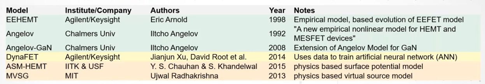

For this summer research project, we chose the Angelov GaN model mainly because it provides effective modeling of GaN HEMTs without requiring detailed physical information about the device or its structure. Given the short project duration and lack of detailed device information from manufacturers, empirical models, particularly the Angelov GaN model, with its higher characteristic and modeling efficiency, were deemed an appropriate choice.


### Angelov Model

#### A Brief Review

This section introduces the foundational literature surveyed for this research, focusing particularly on the paper firstly proposing the Angelov model.

The Angelov model, an empirical model initially proposed by Professor Iltcho Angelov in 1992 for GaAs MESFETs and HEMTs, was later extended to GaN HEMTs as the Angelov-GaN model.

The core equations of the Angelov model describe the drain current, gate current, and nonlinear capacitances (Cgs, Cgd, Cds). Observations of drain and gate currents and nonlinear capacitances typically exhibit hyperbolic tangent characteristics, while the transconductance exhibits a bell-shaped curve, hence the choice of the tanh(x) function as the core empirical fitting function.

The drain current is modeled as a product of VGS-related terms and VDS-related terms as shown below:
$$
I_d = I_{pk0} \left( 1 + \tanh \phi \right) \tanh \left( \alpha V_{ds} \right) \left( 1 + \lambda V_{ds} \right)
\\
\alpha = \alpha_r + (1 + \tanh \phi) \alpha_s
\\
$$
Ipk represents the drain current at the bias corresponding to the maximum transconductance gmpk. λ is a coefficient modeling the lowering of the drain-induced barrier. ψ is modeled as a power series at the peak gm point as follows:
$$
\phi = P_1m (V_{gs} - V_{pks}) + P_2 (V_{gs} - V_{pks})^2 + P_3 (V_{gs} - V_{pks})^3
$$
Vpk is the gate voltage at the maximum gmpk. Additional empirical fitting parameters (P1, P2, P3) are added to fit gate-source voltage dependency. P1 extraction can approximately be computed directly from device characteristics:
$$
P_1 = \frac{g_{mpk}}{I_{pk} (1 + \lambda V_d)} \approx \frac{g_{mpk}}{I_{pk}}
$$
High-frequency properties are modeled using the following equations that empirically fit the nonlinear capacitances to the measured capacitances:
$$
C_{gs} = C_{gspi} + C_{gs0} (1 + \tanh \phi_1)(1 + \tanh \phi_2)
\\
C_{gd} = C_{gdpi} + C_{gd0} (1 + \tanh \phi_3)(1 + \tanh \phi_4)
$$
Additional fitting parameters are introduced to fit the capacitance model:
$$
\phi_1 = P_{10} + P_{11} V_{gs}
\\
\phi_2 = P_{20} + P_{21} V_{ds}
\\
\phi_3 = P_{30} + P_{31} V_{gs}
\\
\phi_4 = P_{40} + P_{41} V_{ds}
$$
The Angelov-GaN model, with its numerous fitting parameters, is capable of capturing some device characteristics. However, the extensive measurement and extraction of parameters pose challenges. The independence of fitting parameters in the I-V equation, such as the collection of P and Φ shown above, may cause the model fitting to somewhat deviate from practical significance.

Moreover, the Angelov model is not based on physics. While the model construction does not provide physical insights to device engineers or circuit designers, and any changes in device process or geometry require re-fitting of the model. However, it could be an advantage for this summer research, since we did not receive physical properties information of the device from the fab.

Overall, the Angelov model is a practical, straightforward, and accurate large-signal empirical model that effectively fits the drain current-gate voltage characteristics and its derivatives, as well as capacitances. Therefore, the Angelov model has been widely applied in modeling HEMTs and MESFETs. It has been used to predict device DC parameters and S parameters, and to simulate the performance of different nonlinear circuits (such as mixers and multipliers) with good accuracy, facilitating the application of devices in actual circuit design.

In summary, using the Angelov model for fitting in this summer research is justified.

#### Developments

This section will outline the evolution of this model, culminating in its adoption as a standard in commercial simulators.

In the literature review, the Angelov model underwent the following developments:

1. **1992**: In "A New Empirical Nonlinear Model for HEMT and MESFET Devices," Iltcho Angelov et al. first introduced the Angelov model. The article proposed a new large-signal model capable of simulating the I-V characteristics and their derivatives, including characteristic transconductance peaks and capacitances, of HEMT and MESFET devices. The model's parameter extraction is direct and effective, and it has been successfully applied to various sub-micron gate-length HEMT devices, including pseudomorphic HEMTs, lattice-matched InP HEMTs, and commercial MESFETs. The model studied the PM2 HEMT depicted below, for which an equivalent circuit model was constructed, and measurements and simulations were conducted;

   

2. **1996**: In "Extensions of the Chalmers Nonlinear HEMT and MESFET Model," Angelov et al. extended the Chalmers nonlinear model to include the capability to simulate temperature effects, dispersion, and soft breakdown. This extension allowed the model to more accurately predict the behavior of commercial HEMT and MESFET devices from different manufacturers across temperatures ranging from 17-400 K. Based on this model, the HEMT's equivalent circuit model was optimized, and parameter extraction and simulation analysis were performed;

   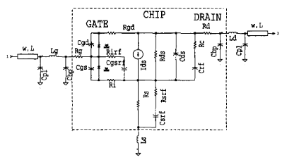

3. **2005**: In "On the large-signal modelling of AlGaN/GaN HEMTs and SiC MESFETs," Angelov et al. developed a universal large-signal model suitable for GaN and SiC FET devices. This model enhanced harmonic management capabilities, offered a more physical treatment of dispersion, and simulated other specific effects in these devices. This model was implemented in simulation tools and demonstrated good accuracy and stability in DC, S, and large-signal measurements;

   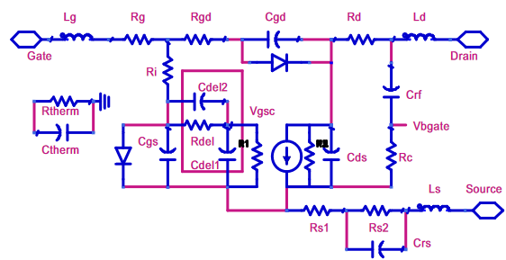

4. **2007**: In "Large-Signal Modelling and Comparison of AlGaN/GaN HEMTs and SiC MESFETs," Angelov et al. further improved the large-signal model for GaN and SiC FET devices, with particular emphasis on enhancing harmonic analysis and providing a physical treatment of dispersion. This improvement made the model perform more accurately in commercial simulation tools;

5. **2010**: In "On the Large Signal Evaluation and Modeling of GaN FET," Angelov et al. expanded the large-signal model for GaN FETs, including bias and temperature-dependent access resistances, modified capacitance and charge equations, and added a breakdown model. These improvements further enhanced the model's overall accuracy in simulation tools;

   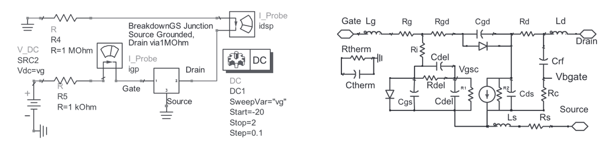

6. **Recent Years**: A series of papers have continued to optimize the Angelov-GaN model, particularly for small gate-length and gate-width GaN HEMTs. These studies extended the standard DC model through parameter analysis, utilized open-short de-embed for RF modeling to capture pad parasitic effects, aligning the model more closely with experimental data on DC I-V Curves and S-parameters.

   

#### Angelov GaN Model

This project is conducted based on the GaN HEMT model released by Keysight:

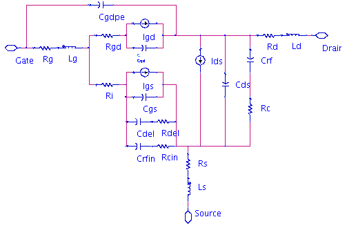


### Integrated Circuit Characterization and Analysis Program (IC-CAP)

IC-CAP, developed by Keysight Technologies, is software utilized for modeling and characterizing semiconductor devices.

#### Designed Workflow

This section introduces the current Modeling Package and the workflow encompassed within the software for the entire extraction project. The measurements and fundamental data collection for this project utilize the IC-CAP integrated Angelov GaN model, located at `ICCAP/examples/model_files/hemt/angelovgan`. I also kept a copy of the original model file in the project file archive.

The designed workflow for the model is outlined as follows:

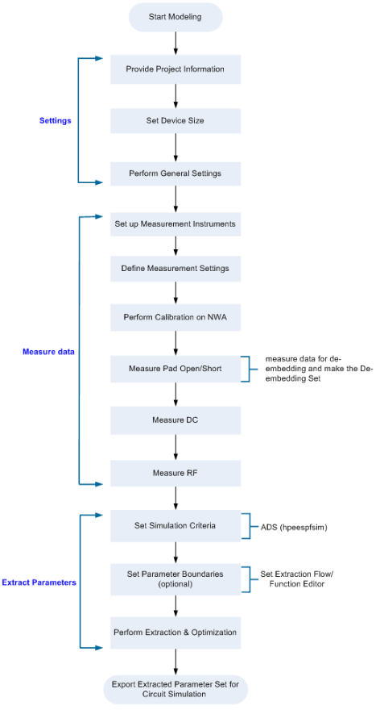


[Back to Table of Contents](# Characterization and Modeling of GaN HEMTs)

<div STYLE="page-break-after: always;"></div>

## Characterization

This section discusses how to perform measurement-based characterization. It will detail the setup procedures tailored to our devices, describe how to configure specific test flows based on the basic information of the device, and aim to complete measurements while ensuring device safety to the greatest extent possible.

This section's help documentation is comprehensive, which can guide our experimental procedures. I will focus primarily on aspects not specifically covered in the help documents or those strongly related to the properties of the Device Under Test (DUT).

### Settings

#### Device Settings

This subsection will explain how to set up the project based on the basic structure of the device.

A significant aspect of this setup is recording the Gate Width and the number of Gate Fingers, which depend on the device itself. This process does not directly affect measurements and parameter extraction but helps make the model more instructive for design purposes.

For this experiment, we measured UltrabandTech's GaN HEMT, with Wafer No. 1R:


 Device parameters can be entered into IC-CAP as shown below:

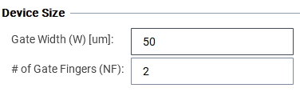

#### Instrument Setting

This section introduces the measurement instruments selected for this experiment and describes how communication is established between IC-CAP and the instruments.

Upon entering the Measure step in IC-CAP, it may appear somewhat chaotic:


However, before commencing the actual measurements, it is essential to determine which instruments are required, ensure that the instruments' range can cover the device testing requirements, and confirm that the planned instruments can communicate properly with our computer. 


For this experiment:

- A Linux-based IC-CAP 2021 is used;
- The HP4142 serves as the DC measurement platform, supporting biases from 40uV to 100V and current supply from 20fA to 100mA. It can function as both Force and Sense, meeting the requirements;
- A Keysight PNA serves as the NWA, supporting network analysis up to 110GHz. Given that the HEMT operates at 28GHz, this satisfies the device requirements.

Once the instruments are chosen, attempts can be made to facilitate communication between the computer and the instruments. Typically, a Linux terminal can connect directly. However, the process may differ with a Windows terminal. In such cases, downloading the `Keysight Connection Expert` and completing the default setup enables communication between IC-CAP and the measurement instruments.


### Measurement Flow Design

#### Pre-Experiments

Although our goal is to test and measure the properties of devices, we cannot begin the design of the measurement process without some prior knowledge of the device.

For this experiment, before the actual measurements, we acquired the device's IV-Curve in a pre-experiment:


An interesting discovery from the preliminary tests is that the results can significantly differ from those of the final experiment. For instance, in this preliminary experiment, a pronounced kink effect is observable, which was less apparent in the final measurement results. We hypothesize that this discrepancy could be due to several factors:

- The use of different instruments in the two tests;
- In the experiment, a negative Vd was applied, which might have mitigated the kink effect to some extent.

In conclusion, the preliminary experiment serves merely as an initial source of information about the device characteristics. It allows us to design the measurement setup based on initial findings, but these preliminary results should not be totally relied upon.

#### Measurement Setting

This section outlines the setup of basic information for the tests, including the calibration settings, measurement limitations, and settings for extraction frequency.


In this step, we need to complete five settings:

1. **Temperature**:
   
   Although we only measure device characteristics at room temperature in this instance, the software defaults to having a temperature list. 

   Our task is to minimize the list to only keep Tnom (25°C) and one additional temperature. I will explain how to make the software operate at room temperature only during the parameter extraction process;
   
2. **Compliance Pre-setting**:
   
   This step is crucial as it serves as the first line of defense in protecting our devices.
   
   We should set these parameters based on the current and voltage measured in preliminary experiments. Key points to note include:
   
   - When our setup measures voltage, the current compliance is active, vice versa;
   - We need to set compliance as absolute values, e.g., for scanning from -3~0V, we set the voltage compliance to 3;
   - Once compliance is set, we can choose to maintain this compliance to synchronize data in subsequent steps, or we can override the defaults by entering new data, but be aware that this step involves certain risks.
   
   For source and substrate compliance, specific to GaN HEMT measurements, we maintain the drain settings;

3. **Frequency Sweep**:
   
   It may be beneficial to expand the sweep range, demonstrating that our model can operate over a broader frequency range, not just a narrow span around the center frequency;

4. **Single Frequency**:
   
   This step is critical as it determines the frequency selection for measuring the capacitances and resistances in the devices, significantly impacting the extraction and fitting of S-parameter data.
   
   Consider the following illustration for design reference:

   
   
   Points of importance include:
   
   - The frequency chosen here must be one that already exists in the sweep matrix;
   - The selection process for this frequency is distinct from the approach used in identifying a flat range in cold FET measurements; they should not be confusing;
   - Given limited information, we may not measure the correct values on the first attempt; feedback will be sought through multiple experiments.

#### Pad Open/Short

This section introduces the measurement of open and short pads, which will be utilized for de-embed calculations.


During the design, there is no need for more concern, but attention should be paid to the following two aspects:

1. Ensure that the temperature matrix remains consistent with that used in the previous step;
2. Ensure that the frequency matrix remains consistent with that used in the previous step.

#### DC Setups

This section introduces a series of DC measurement setups and elaborates on the design rationale based on these measurements.

In DC measurements, there are 4 groups comprising 11 setups:

- **Port R Bias**: Current is applied at two ports to measure the voltage and compute the port resistance.
  1. **Bias_R1_wRT**: Measures Port 1 under Short ISS condition.
  
     
  
  2. **Bias_R2_wRT**: Measures Port 2 under Short ISS condition.
  
     
  
- **Gate Diode**: Measures the physical properties of the Gate Diode. This step involves predicting the pinch-off voltage in preliminary experiments and making adjustments based on measurement results.
  
  3. **ig_vg_f**: Characterizes the forward properties of the gate diode, focusing on the turn-on to saturation region, observing the process of Ig becoming conductive as Vg increases. This requires sweeps until the resistance component is seen in bias, observing the Log Ig vs. Vg curve becoming flat at high voltages.
  
     
  
     To prevent device damage during setup design:
  
     
  
     - Ensure Vd is close to 0;
     - Maintain a conservative Vg strategy and be prepared to adjust based on measurements;
     - Start with a general compliance and be ready to adjust compliance based on results.
  
  4. **ig_vg_r**: Measures the reverse characteristics of the diode:
  
     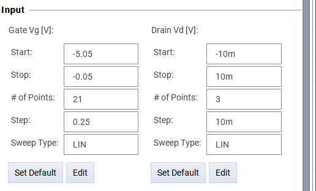
  
     This step is straightforward—observe the leakage current and avoid applying excessive reverse voltage that could lead to breakdown.
  
- **IV-Curve**: The most fundamental and crucial measurement;
  5. **id_vgs**: Measures the increasing region of gm, sweeping until gm begins to decrease with bias.
  
     
  
  6. **id_vds**: The original taste IV-curve, but scanning up to the self-heating point, where the curve at high vds begins to slope downwards.
  
     
  
- **Targeted**: Conducts targeted measurements for the device's anticipated operating areas;
  7. **id_vgs_vg_neg**: Measures the Id and the reverse gate current.
  
     
  
  8. **id_vgs_tgt**: Measures id and vgs under targeted DC bias conditions where vd is between 5-25V.
  
     
  
  9. **id_vds_low**: Characterizes features at low Vd, trying to measure reverse bias carefully to avoid damaging the device.
  
     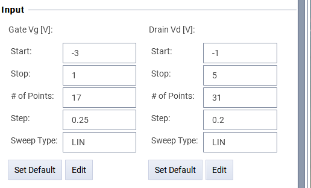
  
  10. **id_vds_high**: Measures high currents by controlling Vg in the target working area and increasing Vds as much as possible, being cautious of device breakdown.
  
      
  
  11. **is_vds_tgt**: Measures characteristics under targeted bias settings; if uncertain of targets, previous settings without considering targets can be used.
  
      

Additional considerations in DC measurements:
1. If there is significant noise in the DC output, try turning off MWA and test again;
2. According to the professor's experience, all measurements should be conducted sequentially. However, experiments with a high potential for damage should be performed last;
3. Choose the right moments to capture data.

#### RF Setups

This section introduces a series of RF measurement setups and explains the rationale behind the measurement design based on the results obtained during the parameter extraction process. 

> It is advised to approach these measurement designs with caution due to potential issues identified.

- Cold FET：

  1. spar_0V: Measures S-parameters when both Vgs and Vds are set to 0.

     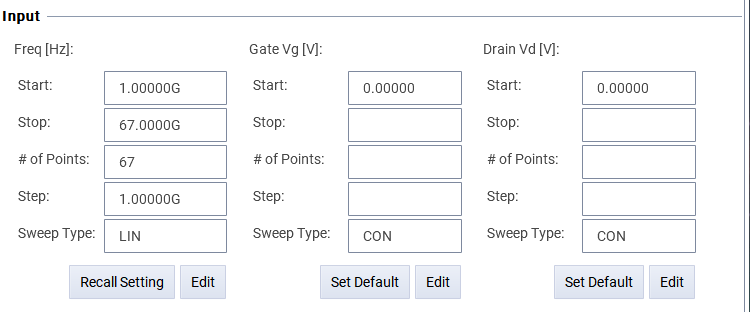

- spar_vg_at_vd0: Keeps Vds at 0 and varies Vg.

  2. A1：Pinch-off Region Characteristics

     

     

  3. A2: Off Region Characteristics

     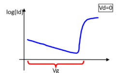

     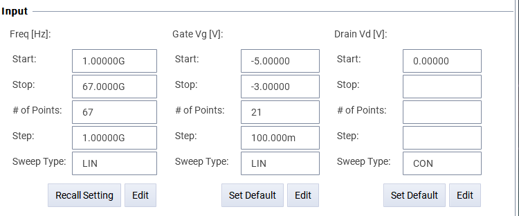

  4. A3: On Region Characteristics

     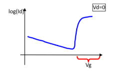

     

- spar_vd_at_vg：Sets Vg to specific values and scans the full range of Vd.

  5. 0：Setting Vg = 0

     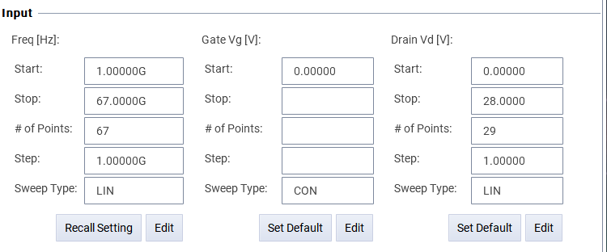

   Following measurements are dependent on the characteristics starting from Vg:

  

  Observations: Linear current starts at vg = -1.75, with turn-off and significant rise points at -2 and -1.5.

  5. gm1：

     

  6. gm2：

     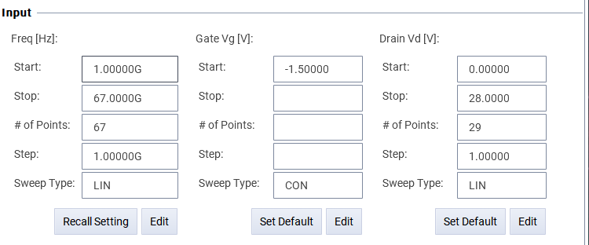

  7. gm3：

     

- spar_vg_vd：Fixed frequency at the capacitance extraction point, Vd maintained high, adjusting Vg according to A1-A3 settings.

  9. vd1：

     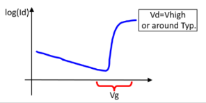

     

  10. vd2：

      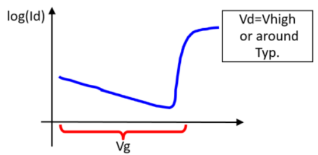

      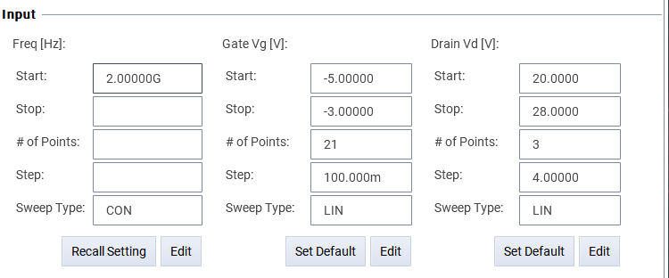

  11. vd3：

      

      

- spar_vg_vd：

  12. FC1：Measures S-parameters across full range of Vd and Vg.

      

  13. FC2：Measures S-parameters across full range of Vd and Vg.

      

- spar_i:

  14. spar_i：Drawing 1/2 of the current flowing from gate side into the drain side and measuring S.

      


### Measurements with Risk Managements

This section will explain how to use the developed program to measure devices.

> The process of measurement is much like life itself:
> The safest way is to stay at home and never venture out,
> but then, we'd harvest nothing.

In testing devices, we inevitably impose some relatively stringent conditions, a high-risk, high-reward process. But of course, we can trade off risk and reward to obtain more effective data within safer boundaries.

> **However, we must always keep a sense of reverence,**
>
> Not be like I once was, like a bull in a china shop.
>
> I was once too confident and didn’t respect the equipments enough;
> And I ended up messing up everything, almost ruining my entire summer research.
>
> This article almost ended right there at that moment.
>
> 
>
> **But I didn’t give up:**
>
> - I learned to be revere, to become a learner before a researcher;
> - I tried my hardest, using every method to continue my work;
> - I learned to face emergencies and emotional swings, and effectively communicating with professors and colleagues.
>
> **Ultimately, I grew in ways I never had from this disaster.**

#### Instrument Setups

This section describes the procedures for connecting instruments and test ports. 

**Pre-Measurement Setup:**

Before initiating measurements, it is crucial to ensure that the instruments are correctly communicating with the computer:


1. **Check the physical connection** between the computer and the repeater, utilizing GPIB for this experiment;
2. **Verify that the computer can correctly scan** and identify the corresponding devices.

**Post-Connection Configuration:**

After establishing a successful connection, proceed with naming and configuring the ports:

- **For DC Measurements:**

     - The hardware names of the measurement instrument ports may differ from the actual names. It is sufficient to rename the corresponding aliases to `SMU1` and `SMU2`;

     - Connect the port designated as `SMU1` to `Port1` using a cable, and similarly for `SMU2`.


- **For RF Measurements:**

     - Rename the network analyzer to `NWA`;

     - Although the help documentation suggests completing `Set NWA` at this stage, this step is actually intended to synchronize the IC-CAP settings with the NWA. There is no need to be confused by this requirement.


**Final Instrument and Probe Station Connection:**

During this step, attention must be paid to the following:

1. Ensure `SMU1-Port1` is connected to the Gate;
2. Ensure `SMU2-Port2` is connected to the Drain;
3. Avoid connecting an SMU to the Source, as this may lead to weird test results;
4. For GaN HEMTs, the Substrate is insulated and should be directly grounded.

#### Measurement Settings

This section introduces the setup for testing, focusing primarily on RF test calibration.

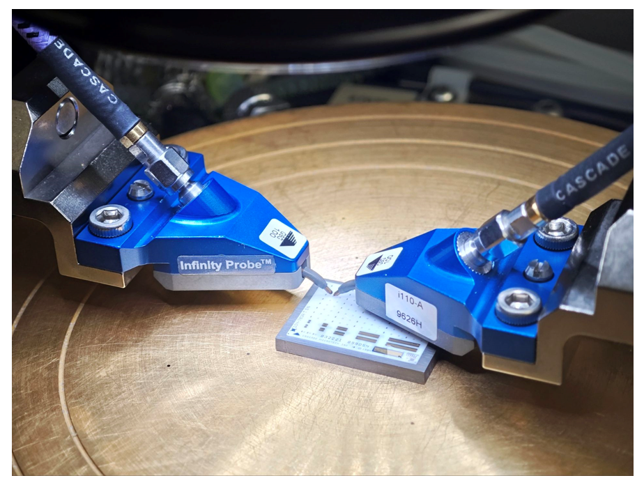

In this experiment, the Network Analyzer (NWA) used cannot be calibrated using a Linux terminal; therefore, we performed the calibration using a Windows terminal and exported the calibration results as a file. This calibration file is stored in the same directory as the model file, under the `meas` folder.

After completing the calibration, we select the 'Set NWA' option to upload the measurement settings from IC-CAP to the NWA.

Two important considerations need to be noted:

1. NWA calibration is highly sensitive; please ensure that measurements are conducted within 12 hours of calibration；
2. At this step, the first two DC setups can be executed initially, specifically measuring the SHORT ISS to extract the port resistance. This strategy minimizes the need to move the probe, reducing the risk.

#### Pad Open/Short and De-Embed Calculations

This section presents an overview of the pad measurements conducted during the experiment.

In this instance, no calibration pads were fabricated on the wafer. Consequently, pads from an alternative sample were utilized as a substitute:

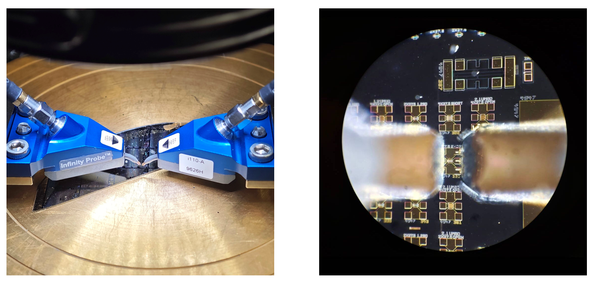

==However, there are two potential risks associated with this approach that might introduce errors into the de-embedd results:==

1. The wafer does not contain a 2x50 pad; the closest available was a 2x37.5, which we measured instead;
2. The pad used for de-embedding was not from the same sample.

Following this step, if the port resistances have been measured as previously described, we can proceed to probe our sample and commence testing without the need to lift the probe.


#### Measurements

This section will detail how to operate the measurement setup and adjust parameters based on the outcomes.

Given that the setup has already been thoroughly discussed, I will focus on the risks commonly encountered during the measurement process, necessary adjustments, and critical points of attention:

- **ig_vg_f**:

  During the actual test, the 2mA compliance setting proved to be low, and no signs of the resistant component were observed in tests conducted at 2.5V.

  To obtain valid data, we initially increased the voltage to 3V and then gradually lifted the compliance. As we adjusted the compliance to 10mA, sign of resistant component became observable in the log Ig curve:

  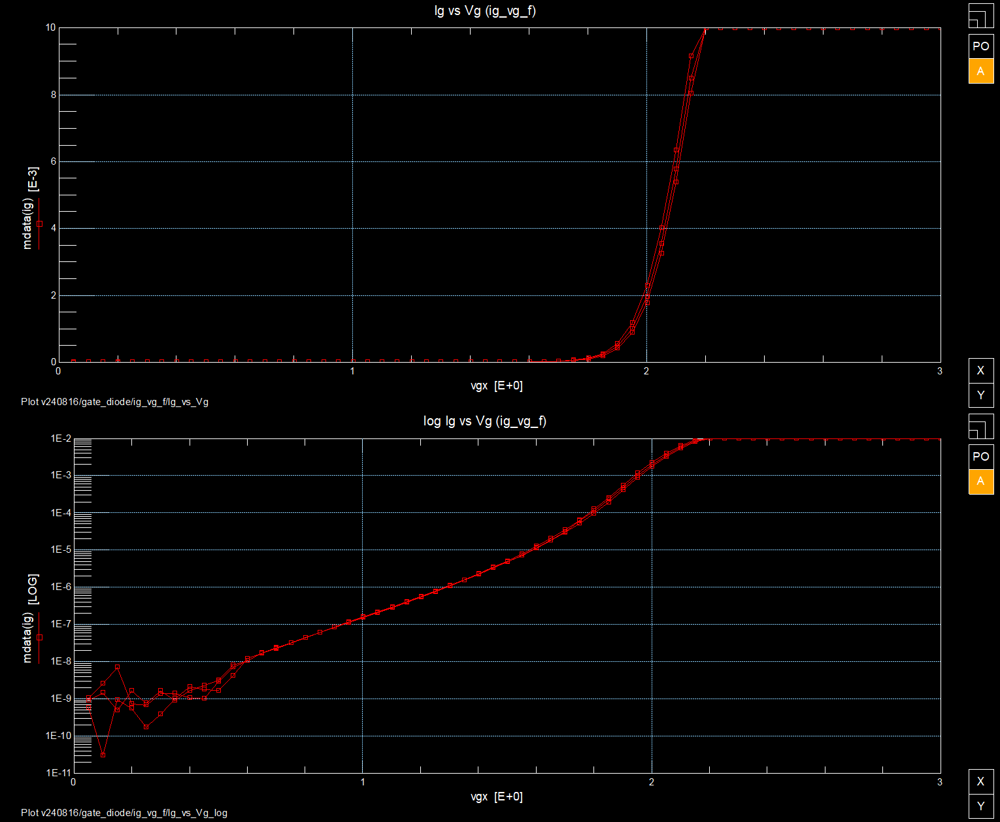

  Although the curve still exhibited distortions due to compliance limitations, we decided, based on the professor's advice, to use these values instead of continuing with further measurements—We had already obtained valuable information, and the risks associated with continued measurement were deemed too high.

  In the simulation process, direct input of data from this output into the data extraction function encountered issues. Manual parameter adjustments were necessary, specifically for `Ij`, which will be discussed later.

- **ig_vg_r**:

  The data obtained in this step was noisy:

  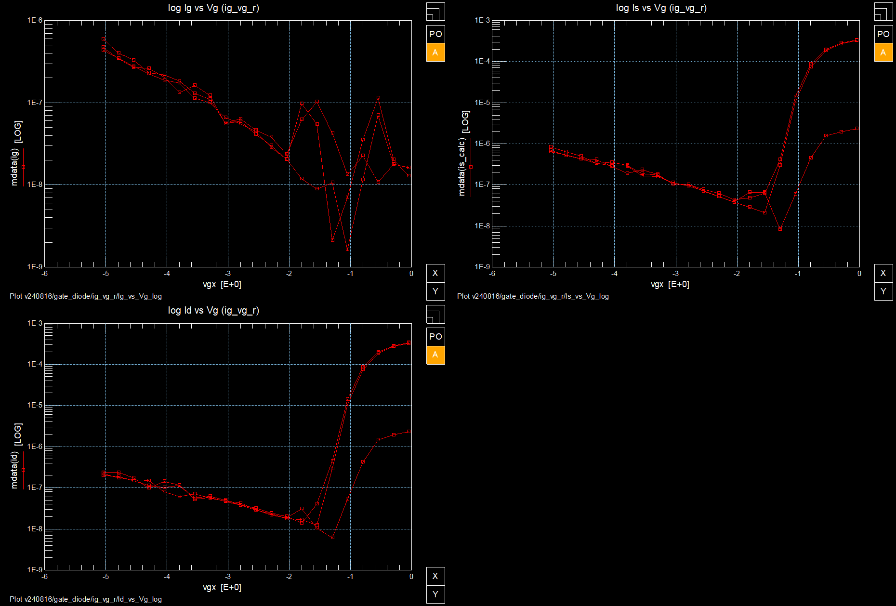

  However, as advised by a PhD senior, practical testing cannot be expected to be as ideal as simulations, thus this data was deemed acceptable.

- **For RF measurements:** 

  there are discrepancies between the data obtained and the trends shown in the demo project. 

  We are currently investigating whether these discrepancies are due to differences in the device properties or issues with the measurement setup design.


[Back to Table of Contents](# Characterization and Modeling of GaN HEMTs)

<div STYLE="page-break-after: always;"></div>

## Modeling

### Angelov GaN Parameters

#### All Parameters

Modeling with Angelov GaN requires the extraction of a series of parameters. 
For the simulator, all parameters have been defined and initialized. 

For the model used in this project, all parameter names, definitions, and default values 
are provided in [Appendix 4.1](### Keysight: Angelov-GaN Parameters Definitions and Default Values).

#### List of Significant Parameters

Not all parameters significantly impact the final simulation results. Moreover, due to differences in the simulator versions used by ICCAP and ADS, a considerable number of parameters that appear in the ADS simulator will not be extracted by ICCAP. Fortunately, testing has shown that these parameters generally do not significantly affect the final fitting results. 

Based on the type of parameters and their impact on the final results, I have divided the parameters into the following three groups; For each parameter, based on the experience gained in this project, there are mainly three sources of information: Calculations from ICCAP; Manual extraction procedures; Tuning based on fitting results.

The parameters that significantly impact the simulation results and are supported for extraction from ICCAP are organized as follows. In the table, I use ICC, MAN, and TUN to represent the sources of information, where 1 indicates that information about this parameter can be obtained in that process.

**DC Characters and Polynomial Coefficients:**

| Parameter | Definition and Description                                   | ICC  | MAN  | TUN  |
| --------- | ------------------------------------------------------------ | ---- | ---- | ---- |
| Ipk0      | Value of drain current (id) at maximum transconductance (gm) | 1    | 0    | 1    |
| Vpks      | Gate voltage (Vg) at maximum transconductance (gm)           | 1    | 0    | 1    |
| Dvpks     | Change in gate voltage at peak transconductance              | 0    | 0    | 1    |
| P1        | Polynomial coefficient for channel current at peak gm        | 0    | 1    | 1    |
| P2        | Polynomial coefficient for channel current                   | 0    | 0    | 1    |
| P3        | Polynomial coefficient for channel current                   | 0    | 0    | 1    |
| Alphar    | Saturation parameter alpha r                                 | 0    | 0    | 1    |
| Alphas    | Saturation parameter alpha                                   | 0    | 0    | 1    |
| Lambda    | Channel length modulation parameter                          | 0    | 0    | 1    |
| Lambda1   | Channel length modulation parameter                          | 0    | 0    | 1    |
| Ij        | Gate forward saturation current                              | 0    | 0    | 1    |

**Capacitance Parameters and Polynomial Coefficients:**

| Parameter | Definition and Description             | ICC  | MAN  | TUN  |
| --------- | -------------------------------------- | ---- | ---- | ---- |
| Cds       | Zero-bias drain-source capacitance     | 1    | 0    | 1    |
| Cgspi     | Gate-source pinch-off capacitance      | 1    | 0    | 1    |
| Cgs0      | Gate-source capacitance parameter      | 1    | 0    | 1    |
| Cgdpi     | Gate-drain pinch-off capacitance       | 1    | 0    | 1    |
| Cgd0      | Gate-drain capacitance parameter       | 1    | 0    | 1    |
| Cgdpe     | External gate-drain capacitance        | 1    | 0    | 1    |
| P10       | Polynomial coefficient for capacitance | 0    | 1    | 1    |
| P11       | Polynomial coefficient for capacitance | 0    | 1    | 1    |
| P20       | Polynomial coefficient for capacitance | 0    | 1    | 1    |
| P21       | Polynomial coefficient for capacitance | 0    | 1    | 1    |
| P30       | Polynomial coefficient for capacitance | 0    | 1    | 1    |
| P31       | Polynomial coefficient for capacitance | 0    | 1    | 1    |
| P40       | Polynomial coefficient for capacitance | 0    | 1    | 1    |
| P41       | Polynomial coefficient for capacitance | 0    | 1    | 1    |

**Resistance and Inductance Parameters:**

| Parameter | Definition and Description | ICC  | MAN  | TUN  |
| --------- | -------------------------- | ---- | ---- | ---- |
| Rg        | Gate resistance            | 1    | 0    | 1    |
| Rd        | Drain resistance           | 1    | 0    | 1    |
| Rs        | Source resistance          | 1    | 0    | 1    |
| Ri        | Input resistance           | 1    | 0    | 1    |
| Rgd       | Non-ohmic gate resistance  | 1    | 0    | 1    |
| Lg        | Gate inductance            | 1    | 0    | 1    |
| Ld        | Drain inductance           | 1    | 0    | 1    |
| Ls        | Source inductance          | 1    | 0    | 1    |


### IC-CAP Extraction Flow 

#### Extraction Flow Overview

This section presents the native parameter extraction process designed within the IC-CAP software.

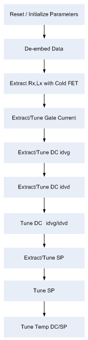

Specifically, the process is divided into seven major sections, each containing the extraction setup displayed in the software. Within these setups, we can obtain the necessary parameters as detailed below (steps involving the extraction of core parameters are **bolded**):

1. **Initialize:**
   1. Reset Parameter to Defaults:
   2. Initialize Parameter and Boundaries for Extraction:
   3. Update All Measures Data for Extraction:
2. **Port Res:**
   1. **PreDC Port1: Z1;**
   2. **PreDC Port2: Z2;**
3. **Cold FET:**
   1. **SP Cold FET: Rg, Rd, Rs, Lg, Ld, Ls;**
4. **Gate Diode:**
   1. DC gate diode forward:
   2. DC gate diode reverse:
5. **DC idvd & idvg:**
   1. **DC idvg: Ipk0, Vpks**
   2. DC idvd:
   3. DC idvg:
   4. DC idvd:
   5. DC idvg:
6. **SP vg & vd:**
   1. SP vg at vd0 A1: 
   2. SP vg at vg0:
   3. **SP vg at vd0 A1: Cgs0, Cgspi, Cds, Cgd0, Cgdpi, Ri, Rgd;**
   4. **SP vg at vg0: Cgs0, Cgspi, Cds, Cgd0, Cgdpi**
   5. **SP vg at vgm2: Cgdpe**
7. **Finalize:**
   1. Save Parameters:

Certainly, this process is not without its imperfections, particularly in the fitting process where numerous errors can arise. According to my tests, the software’s built-in extraction flow fails to fully execute even its own demo programs, and the debugging process is considerably complex.

Based on discussions with my professor, it was emphasized that software is not a **panacea**; rather, it should serve as a catalyst for inspiration, while returning to the literature may provide clearer answers. 

Consequently, the objectives for this work are:

1. To successfully execute the entire extraction flow;
2. To compute a subset of parameters using IC-CAP;
3. To subsequently manually extract the remaining parameters based on these computed values and definitions found in the literature;
4. Finally, to derive all parameters based on the tuning results in ADS.

#### Debugging

This section will detail the debugging process prior to executing the Extraction Flow.

Utilizing the software’s built-in procedures requires the extraction of a series of temperature-sensitive parameters, compelling the system to require measurements at two different temperatures. 

Specifically, the software prohibits the selection of a shrink list:

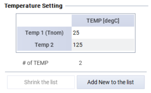

However, the testing platform available during this summer research only supports measurements at room temperature, which conflicts with the software requirements.

During the parameter extraction process, this issue manifests as the software interrupts the initialization process and prevents further extraction, thereby blocking all parameter retrieval from IC-CAP.

To resolve this issue, the following steps can be undertaken:

- Select the room temperature (Tnom) test data and export it;
- Choose another temperature's corresponding setup and import the room temperature data;
- Do not forget to select "Copy Tnom Settings"; otherwise, the program will still fail to execute.

Upon running the test flow with these settings, the program should execute.
Typically presenting three types of errors:

- The optimization function displays "Data Unchanged," which is relatively normal and indicates that the fitting results have reached their optimum;
- The optimization function interrupts and displays an error in the simulator, a more challenging issue. One can attempt to rerun from the previous step, which in most cases causes this error to disappear;
- The terminal output shows significant errors with unchanged data, requiring a nuanced discussion:
  - If parameters reach the preset limits of the simulation, consider adjusting these limits;
  - However, in most cases, the function simply does not operate effectively;
    In fact, I spent a week investigating this issue without a definitive answer;
    It was at this point that the professor reminded me **not to place blind faith in this software**.


### Parameter Extractions

#### IC-CAP Data Output

This section summarizes all parameters retrieved from IC-CAP.

For definitions of these parameters, please refer to the list of all parameters or the list of significant parameters earlier in the document. This section primarily integrates data extraction from ICCAP to derive these parameters.

The following details the process of retrieving all parameters:

**DC Characters and Polynomial Coefficients:**

- Vpks: -0.1

  Peak gm located between -0.1 and 0

  

- Ipks: 0.033

  Current value at Vpks=-0.1

  

**Capacitance Parameters and Polynomial Coefficients:**

- As for the help document:

  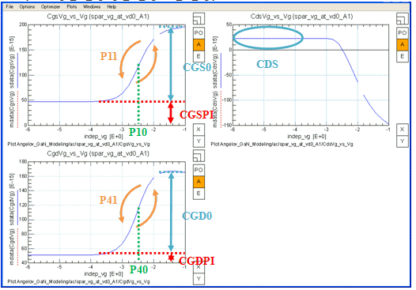

  Resulting in:

  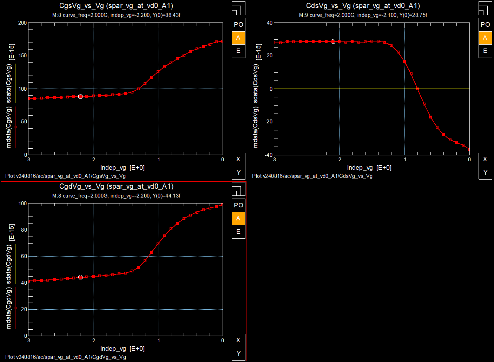

  - Cgs0: 83;
  - Cgspi: 88;
  - Cds: 29;
  - Cgd0: 53;
  - Cgdpi: 44;

- Following another section of the help document:

  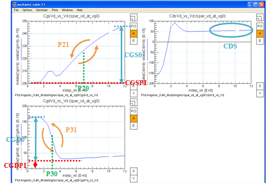

  Produced results:

  

  - Cgs0: 20;
  - Cgspi: 150;
  - Cds: 20;
  - Cgd0: 93;
  - Cgdpi: 5;

  ==Concerning discrepancies as these curves do not match the trends presented in the help documentation.==

- Final analysis according to the help document:

  

  Observing the measurement results:

  

  Cgdpe:5.2;

**Resistance and Inductance Parameters:**

- Based on the Cold FET setup in the help document:

  

  According to the paper, resistance values should be extracted from the low-frequency flat range, and inductance values from the high-frequency flat range:

  

  For the resistance：

  - Rg: 25.2;
  - Rd: 13.0;
  - Rs: 9.2;

  For the capacitance：

  - Lg: 20.0;
  - Ld: 39.4;
  - Ls: -9.4;


==Two points of concern:== 

1. Neither the Demo Project nor the low-frequency range exhibited a flat range;
2. Ls resulted in a negative value.

- Reading of Ri:

  

  Ri = 8.0;

- Reading of Rgd:

  

  Rgd = 27.2.

#### Manual Extractions

Due to software issues with IC-CAP, a series of parameters could not be effectively extracted during the extraction and tuning process. Consequently, we undertook a series of manual extractions to obtain parameters suitable for modeling.

DC Characters and Polynomial Coefficients:

- P1：This step involves calculating the ratio of the maximum transconductance (gm) to the corresponding drain current (Id):

  
  $$
  P1 = \frac{gm_{max}}{Id} = \frac{35.79}{33.13} = 1.08
  $$

Capacitance Parameters and Polynomial Coefficients:

In this section, we need to:

1. First, determine the parameters to be extracted by transcribing data into MATLAB based on the information provided in the help documentation.
2. Perform function operations and linear fitting based on the definitions of parameters described in the literature.

Specifically, we complete this process in the following steps:

Initially, we consult the help documentation for descriptions of the polynomial coefficients for capacitance.


Then, we copy the data into MATLAB：

```matlab
vg = [-3:0.2:0];
cgsvg = [85.67,86.18,86.87,88.15,88.43,89.28,90.35,91.66,95.31,108.2,126.0,139.6,151.1,160.5,167.7,172.5];
cgdvg = [41.4,42.0,42.6,43.6,44.1,44.9,45.6,46.9,49.0,56.7,69.6,80.8,88.6,93.6,96.6,98.9];

vd = [0:1:28];
cgsvd = [172.8,163.4,153.5,152.1,152.2,155.0,157.1,158.8,160.2,161.6,162.9,164.3,165.5,166.6,168.0,168.2,168.5,168.9,169.4,169.7,170.1,170.3,170.0,170.1,170.2,170.4,170.4,170.3,170.2];
cgdvd = [98.8,76.0,49.8,39.5,31.7,25.1,19.4,15.3,12.5,10.6,9.2,8.1,7.2,6.6,6.0,5.6,5.2,4.9,4.6,4.4,4.2,4.1,3.9,3.7,3.6,3.6,3.5,3.4,3.4];

cgspi =     88;
cgs0 =      83;
cgdpi =     44;
cgd0 =      53;
```

We could plot the values for double check.

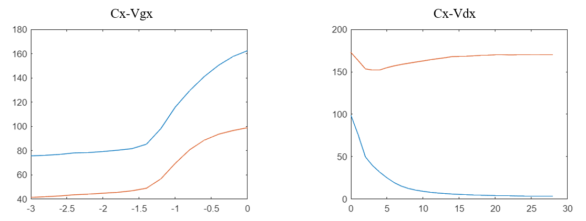

We could check the formulas in the Angelov's papers:


Where:


Then, we shall calculate:

- **P11 P10:**

  We got:

  

  Performance linear regression in MATLAB:

  ```MATLAB
  % p11vgs+p10
  y1 = atanh(((cgsvg-cgspi)/(cgs0))-1);
  
  % Find indices for vg between -1.4 and -0.6
  idx = find(vg >= -1.7 & vg <= -0.9);
  
  % Linear fit for y1 over the selected range of vg
  p11p10 = polyfit(vg(idx), y1(idx), 1)  
  % Linear fit, p(1) is slope, p(2) is intercept
  
  % Generate values from linear fit
  y_fit = polyval(p11p10, vg(idx));
  
  % Plotting
  clf;
  plot(vg, y1, 'b-', 'DisplayName', 'Original y1'); hold on;
  plot(vg(idx), y_fit, 'r--', 'DisplayName', 'Linear Fit');
  ```

  Performance linear regression in MATLAB:
  The result is as follow. Here we ignored the imaginary part, but the result is not affected:

  

  Finally:

  ```
  p11p10 = 1×2
      2.2086    1.6136
  ```

- **P41 P40:**

  We got:

  

  Performance linear regression in MATLAB:

  ```MATLAB
  % p41vds+p40
  y4 = atanh(((cgdvg-cgdpi)/cgd0)-1);
  
  % Find indices for vg between -1.4 and -0.6
  idx = find(vg >= -1.5 & vg <= -0.8);
  
  % Linear fit for y1 over the selected range of vg
  p41p40 = polyfit(vg(idx), y4(idx), 1)  
  % Linear fit, p(1) is slope, p(2) is intercept
  
  % Generate values from linear fit
  y_fit = polyval(p41p40, vg(idx));
  
  % Plotting
  clf;
  plot(vg, y4, 'b-', 'DisplayName', 'Original y1'); hold on;
  plot(vg(idx), y_fit, 'r--', 'DisplayName', 'Linear Fit');
  ```

  The result is as follow. Here we ignored the imaginary part, but the result is not affected:

  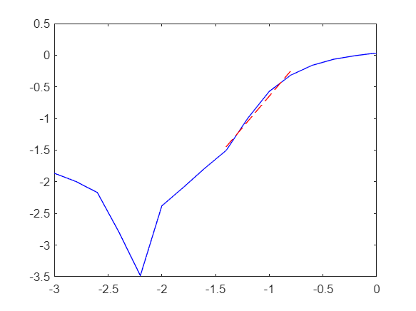

  Finally:

  ```
  p41p40 = 1×2
      1.9931    1.3454
  ```

- **P21 P20:**

  We got:

  

  Performance linear regression in MATLAB:

  ```MATLAB
  % p21vds+p20
  p10 = p11p10(2)
  y2 = atanh(((cgsvd-cgspi)/(cgs0*(1+tanh(p10))))-1);
  
  % Find indices for vg between -1.4 and -0.6
  idx = find(vd >= 0 & vd <= 3);
  
  % Linear fit for y1 over the selected range of vg
  p21p20 = polyfit(vd(idx), y2(idx), 1)  
  % Linear fit, p(1) is slope, p(2) is intercept
  
  % Generate values from linear fit
  y_fit = polyval(p21p20, vd(idx));
  
  % Plotting
  clf;
  plot(vd, y2, 'b-', 'DisplayName', 'Original y1'); hold on;
  plot(vd(idx), y_fit, 'r--', 'DisplayName', 'Linear Fit');
  ```

  The result:

  

  Finally:

  ```
  p21p20 = 1×2
     -0.0637   -0.5204
  ```

  ==Here comes the problem: The minimum value that the simulator could take for P21 is 0.1.==

- **P31 P30:**

  We got:

  

  Performance linear regression in MATLAB:

  ```MATLAB
  % p31vds+p30
  p40 = p41p40(2)
  p41 = p41p40(1)
  
  y3 = zeros(size(vd));
  
  for i = 1:length(vd)
      tanh_value = tanh(p40 - p41 * vd(i));
      y3(i) = (atanh(((cgdvd(i) - cgdpi)/(cgd0 * (1 + tanh_value))) - 1));
  end
  
  % Find indices for vg between -1.4 and -0.6
  idx = find(vd >= 0.1 & vd <= 3);
  
  % Linear fit for y1 over the selected range of vg
  p31p30 = polyfit(vd(idx), y3(idx), 1)  
  % Linear fit, p(1) is slope, p(2) is intercept
  
  % Generate values from linear fit
  y_fit = polyval(p31p30, vd(idx));
  
  % Plotting
  clf;
  plot(vd, y3, 'b-', 'DisplayName', 'Original y1'); hold on;
  plot(vd(idx), y_fit, 'r--', 'DisplayName', 'Linear Fit');
  ```

  ==The result is as follow. Here we ignored the imaginary part, AND the result IS affected:==

  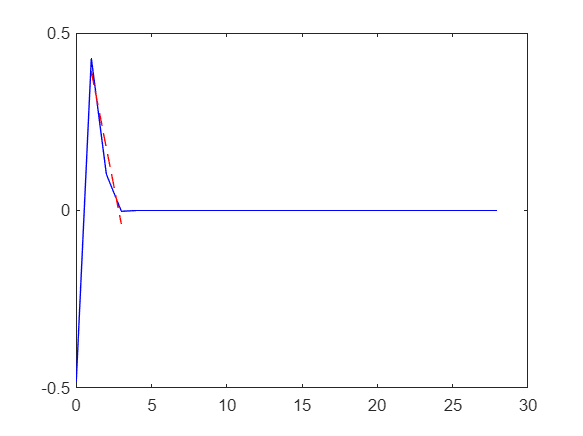

  Finally:

  ```
  p31p30 = 1×2 complex
    -0.2156 - 0.7854i   0.6075 + 1.5708i
  ```

  ==Here we got the imaginary number, which could not be used in the simulator.==

#### Result of Extractions

Up to now, we have got the following parameters. Errors are highlighted.

**DC Characters and Polynomial Coefficients:**

| Parameter | Definition and Description                                   | Original Value |
| --------- | ------------------------------------------------------------ | -------------- |
| Ipk0      | Value of drain current (id) at maximum transconductance (gm) | 0.033          |
| Vpks      | Gate voltage (Vg) at maximum transconductance (gm)           | -0.1           |
| Dvpks     | Change in gate voltage at peak transconductance              | ==NA==         |
| P1        | Polynomial coefficient for channel current at peak gm        | 1.08           |
| P2        | Polynomial coefficient for channel current                   | ==NA==         |
| P3        | Polynomial coefficient for channel current                   | ==NA==         |
| Alphar    | Saturation parameter alpha r                                 | ==NA==         |
| Alphas    | Saturation parameter alpha                                   | ==NA==         |
| Lambda    | Channel length modulation parameter                          | ==NA==         |
| Lambda1   | Channel length modulation parameter                          | ==NA==         |
| Ij        | Gate forward saturation current                              | ==NA==         |

**Capacitance Parameters and Polynomial Coefficients:**

| Parameter | Definition and Description             | Original Value  |
| --------- | -------------------------------------- | --------------- |
| Cds       | Zero-bias drain-source capacitance     | 29              |
| Cgspi     | Gate-source pinch-off capacitance      | 88              |
| Cgs0      | Gate-source capacitance parameter      | 83              |
| Cgdpi     | Gate-drain pinch-off capacitance       | 44              |
| Cgd0      | Gate-drain capacitance parameter       | 53              |
| Cgdpe     | External gate-drain capacitance        | 5.2             |
| P10       | Polynomial coefficient for capacitance | 1.61            |
| P11       | Polynomial coefficient for capacitance | 2.21            |
| P20       | Polynomial coefficient for capacitance | -0.52           |
| P21       | Polynomial coefficient for capacitance | ==-0.06==       |
| P30       | Polynomial coefficient for capacitance | ==0.61+1.57i==  |
| P31       | Polynomial coefficient for capacitance | ==-0.22-0.79i== |
| P40       | Polynomial coefficient for capacitance | 1.35            |
| P41       | Polynomial coefficient for capacitance | 1.99            |

**Resistance and Inductance Parameters:**

| Parameter | Definition and Description | Original Value |
| --------- | -------------------------- | -------------- |
| Rg        | Gate resistance            | 25.2           |
| Rd        | Drain resistance           | 13             |
| Rs        | Source resistance          | 9.2            |
| Ri        | Input resistance           | 8.0            |
| Rgd       | Non-ohmic gate resistance  | 27.2           |
| Lg        | Gate inductance            | 20.0           |
| Ld        | Drain inductance           | 39.4           |
| Ls        | Source inductance          | ==-9.4==       |


### Simulations and Optimizations

#### Export IC-CAP Models to ADS

The methods described in the IC-CAP official help documentation are not entirely applicable.

Upon completing data export from IC-CAP, two files are generated:
1. A `.lib` file containing the name of the simulator.
2. A `.mps` file named after the IC-CAP project.

To import these files into ADS, the following steps are necessary:

1. Given that the Angelov GaN model employs Verilog-A, it is imperative to incorporate the Verilog-A design kit first. According to the ADS manual, the specific procedures are as follows:
   > 0. From the ADS Main window, select DesignKit > Manage Favorite Design Kits to open the Manage Favorite Design Kits dialog box.
   > 1. As the Design Kit is provided as an unzipped file, click Add Library Definition File and navigate to $HPEESOF_DIR/tiburonda/ads/designkits/tiburon-da_veriloga (path under the ADS installation directory).
   > 2. Choose the lib.defs file and select Open.
   > 3. In the subsequent Add Design Kit dialog box, confirm addition of the design kit to the current workspace by clicking OK.
   > 4. If a design is open, a warning stating “All designs must be closed to Add a Design Kit” will appear.
   > 5. Close all designs and click OK to add the design kit to your workspace.
   > 6. After closing the Manage Favorite Design Kits dialog box, open a schematic window. The Devices-Verilog-A palette should now appear in the Component Palette List, as depicted below showing icons for each device and model available.

2. Loading the Model card can be accomplished by two approaches:
   1. Use tools->IC-CAP import->Any Device, enter `angelov_gan_va_Model` (mind the case sensitivity), then select the previously generated .mps document in the dialog that appears. The outcome after loading will be ready for further operations.
   2. Use DynamicLink->Add Netlist File Include. Double-click the icon and select the previously generated .lib file (ensure the path to the Verilog-A file in the lib is correct).

   Compared to method 2, method 1 offers more flexibility allowing for parameter tuning, whereas method 2, as recommended by ICCAP, confines the simulation to the exported files only.

#### Simulations Setups

We could build up the simulation circuits in ADS.

**For DC:**


**For S-Parameter:**


After the simulation circuit construction is complete, we may still encounter certain issues. Here are solutions to two common problems:

1. If the simulator issues a warning, this can typically be resolved by naming the ports appropriately.
2. If the simulator reports an error during simulation, indicating an issue with the provided instance, the following two problems may be present:
   1. The parameter model and the FET might not be using the same model type. It is essential to ensure that both models are either in the native ADS format or in the VerilogA format.
   2. The name of the parameter model may differ from that of the FET model.

#### Preparations for Simulations Result Analysis

Observing simulation results alone is insufficient for evaluating the fitting outcomes. It is essential to import IC-CAP measurement results into ADS for comparison with simulation tests.

Regrettably, attempts to import the default `.mdl` output from IC-CAP into various versions of ADS (ranging from 2017 to 2024) using the Data Tools option in the report page have consistently resulted in issues. Extensive searches in various technical forums have yet to yield a definitive solution.

During this process, there is a risk of overwriting existing simulated data, causing it to disappear from the data set interface. However, the overwritten simulation data can be recovered by re-running the simulation for the specified cell.

We have identified indirect methods to address this issue, with slight variations for DC and RF measurements:

- **For DC Measurement Data Import into ADS**:
  1. In IC-CAP, select `File > Export`.
  2. Export the measurement data as a `.ds` file, which is the native data format for ADS.
  3. Import the exported `.ds` file directly into the data folder of the ADS project.
  4. Retrieve the necessary data, where files ending in `.m` are measurement files and those ending in `.s` are simulation files.
  5. Select the appropriate data and verses relationships to plot the IV curve.

- **For RF Measurement Data Import into ADS**:
  1. In IC-CAP, choose `Save As`.
  2. Save the required `.mdl` file as a `.dut` file.
  3. In ADS, use the Data Tool to select the file to import.
  4. Enter a unique name for the data at the bottom.
  5. Choose IC-CAP for data import.
  6. The data format will be automatically written as `.ds` by ADS.
  7. Retrieve the data, where `.sd()` indicates data calculated with de-embed and `.s()` indicates raw measurement data.
  8. Directly select the appropriate data for comparative plotting.

After importing the data, comparisons can be made to assess the adequacy of the fitting results. However, I have spent time addressing the following misconceptions:

- **For DC**:
  1. Data labels can be enabled to verify that fitting was done correctly for the specified Vgs.
  2. Different operational areas with varying fitting quality can be plotted separately to enhance data visualization.

- **For RF**:
  1. Properly planning the frequency scan step can significantly improve simulation efficiency and data display.
      1. Increasing the step during parameter adjustment can speed up the simulation.
      2. Reducing the step during result analysis can clarify the data fitting situation.

However, I still face an unresolved issue: RF measurements default to line display, but simulation results can only be presented as dots. This greatly hinders the visibility of simulation outcomes. I noticed a similar data presentation style in Angelov's papers, leading me to suspect this may be a common issue in ADS simulations.

#### Original Results

The extracted functions were directly input into the simulator to observe the results, where the measured data is represented in blue and the simulated data in red.

**DC Simulation Results:**


**S-Parameter Simulations were conducted in three scenarios:**

Cold FET:


Vgs Scan without applying Vds:


Vds Scan from 0-28V at Vgs = 1.75, where gm pinch-off occurs:


> Upon reviewing the results, 
> It was disheartening to observe the discrepancies between the simulations and the measurements,
> Especially considering the professor's likely critique that the outcomes look 'funny'.

#### Optimization of Significant Parameters in ADS

This section will synthesize the core parameters listed above, primarily from the perspective of simulation results, to elucidate the impact of each parameter on the outcomes of the simulations.

In scenarios where direct usage of extracted data fails to complete the fitting process, adjustments based on this section can be made to mitigate the influence of measurement errors on the simulation results.

However, since the content in this part is not based on documented literature or measurement results, it is advisable to critically evaluate these conclusions. Caution should be maintained during the adjustment process.

DC Characters and Polynomial Coefficients:

| Parameter | Effect on DC                                                 | Effect on S-Parameters                                       |
| --------- | ------------------------------------------------------------ | ------------------------------------------------------------ |
| Ipk0      | Magnitude of drain current (Id)                              | Influential, but tuning is not recommended                   |
| Vpks      | Position of the turn-on voltage in the Id-Vg                 | Influential, but tuning is not recommended                   |
| Dvpks     | Slope in the turn-on region; gate diode conduction position  | Discreteness at low-frequency start in pinch-off simulation, smaller values lead to greater discreteness |
| P1        | Density of the Id-Vd curves as gate voltage is swept, negative values indicate inverse relationship between Vg and turn-on current | Influential, but tuning is not recommended                   |
| P2        | Voltage at the peak gm in Id-Vd curves                       | Discreteness at low-frequency start in pinch-off simulation, larger values lead to greater discreteness |
| P3        | Density of the Id-Vd curves                                  | Discreteness at low-frequency start in pinch-off simulation, smaller values lead to greater discreteness |
| Alphar    | Slope and curve disparity in the turn-on region              | Influential, but tuning is not recommended                   |
| Alphas    | Sharpness of the transition from turn-on to saturation regions | Influential, but tuning is not recommended                   |
| Lambda    | Slope in the saturation region                               | Influential, but tuning is not recommended                   |
| Lambda1   | Slope in the saturation region                               | Influential, but tuning is not recommended                   |
| Ij        | Current spread at high voltage in the off region, very minimal | None                                                         |

Capacitance Parameters and Polynomial Coefficients:

| Parameter | Effect on DC | Effect on S-Parameters                                       |
| --------- | ------------ | ------------------------------------------------------------ |
| Cds       | None         | Phase difference in S22 increases with value; S21 phase difference also increases |
| Cgspi     | None         | Outer magnitude of S21 decreases with value                  |
| Cgs0      | None         | Inner magnitudes of S21 and S12 decrease with value; outer magnitude of S12 increases |
| Cgdpi     | None         | Curvature of S21 increases with value                        |
| Cgd0      | None         | Sequence of curve                                            |
| Cgdpe     | None         | Dispersion of S21 and S12                                    |
| P10       | None         | Dependent variable, tuning not recommended                   |
| P11       | None         | Dependent variable, tuning not recommended                   |
| P20       | None         | Dependent variable, tuning not recommended                   |
| P21       | None         | Dependent variable, tuning not recommended                   |
| P30       | None         | Dependent variable, tuning not recommended                   |
| P31       | None         | Dependent variable, tuning not recommended                   |
| P40       | None         | Dependent variable, tuning not recommended                   |
| P41       | None         | Dependent variable, tuning not recommended                   |

Resistance and Inductance Parameters:

| Parameter | Effect on DC                                                 | Effect on S-parameters                                       |
| --------- | ------------------------------------------------------------ | ------------------------------------------------------------ |
| Rg        | None                                                         | S11 amplitude decreases with increasing value; dispersion and phase difference in S21 and S12 also decrease |
| Rd        | Amplitude of id-vg curves                                    | Amplitude of S22 and S12 decreases with increasing value     |
| Rs        | Amplitude of idvd; forward conduction region amplitude in idvg | S11 and S22 amplitude decreases with value; dispersion and phase difference in S21 and S12 also decrease |
| Ri        | None                                                         | S11 amplitude decreases with increasing value; phase difference and dispersion in S21 and S12 also decrease |
| Rgd       | None                                                         | S22 amplitude decreases with value; phase difference in S21 and S12 increases |
| Lg        | None                                                         | Phase difference in S11 increases with value; similar increase in phase difference for S21 and S12 |
| Ld        | None                                                         | Phase difference in S22 decreases with value; amplitude and phase difference in S21 increase; phase difference in S12 also increases |
| Ls        | None                                                         | Phase difference in S11 and S22 increases with value; S21 and S12 show inner curling at higher frequencies |

#### Fitting Results (Updated at Aug 29 2024)

**DC Simulation Results:**


**S-Parameter Simulations were conducted in three scenarios:**

Cold FET:


Vgs Scan without applying Vds:


Vds Scan from 0-28V at Vgs = 1.75, where gm pinch-off occurs:


[Back to Table of Contents](# Characterization and Modeling of GaN HEMTs)

<div STYLE="page-break-after: always;"></div>

## Appendix

### Keysight: Angelov-GaN Parameters Definitions and Default Values


### Hand-Scripts of Angelov Model Parameter Extractions


A little bit extensive, lease check the full file on my Github `/billboard`:


<center>https://github.com/EliotChen8/Characterization-and-Modeling-of-GaN-HEMTs/tree/main/billboard</center>


### Mindmap for Measurement Troubleshooting

A `.xmind` native file, please check the full file on my Github `/billboard`:


<center>https://github.com/EliotChen8/Characterization-and-Modeling-of-GaN-HEMTs/tree/main/billboard</center>


### List of Parameter at Excel

A `.xlsx` native file, please check the full file on my Github `/billboard`:


<center>https://github.com/EliotChen8/Characterization-and-Modeling-of-GaN-HEMTs/tree/main/billboard</center>


### Notes on the IC-CAP Help Doc

A little bit extensive, please check the full file on my Github `/billboard`:


<center>https://github.com/EliotChen8/Characterization-and-Modeling-of-GaN-HEMTs/tree/main/billboard</center>


### See also: The Draft of Dual-Language 

Hi, our friends from Taiwan! 
Please check the full file on my Github `/document`:


<center>https://github.com/EliotChen8/Characterization-and-Modeling-of-GaN-HEMTs/tree/main/document</center>


[Back to Table of Contents](# Characterization and Modeling of GaN HEMTs)

<div STYLE="page-break-after: always;"></div>

## Reference

[1] Y. W. W. Zhang, “An Angelov Large Signal Model and its Parameter Extraction Strategy for GaAs HEMT”.

[2] “GaN based gas sensors - Department of Electrical and Electronics Engineering.” Accessed: Aug. 31, 2024. [Online]. Available: https://eee.sustech.edu.cn/?p=3186&lang=en

[3] W. R. Curtice, “A MESFET Model for Use in the Design of GaAs Integrated Circuits,” IEEE Transactions on Microwave Theory and Techniques, vol. 28, no. 5, pp. 448–456, May 1980, doi: 10.1109/TMTT.1980.1130099.

[4] I. Angelov, H. Zirath, and N. Rosman, “A new empirical nonlinear model for HEMT and MESFET devices,” IEEE Transactions on Microwave Theory and Techniques, vol. 40, no. 12, pp. 2258–2266, Dec. 1992, doi: 10.1109/22.179888.

[5] I. Angelov, L. Bengtsson, and M. Garcia, “Extensions of the Chalmers nonlinear HEMT and MESFET model,” IEEE Transactions on Microwave Theory and Techniques, vol. 44, no. 10, pp. 1664–1674, Oct. 1996, doi: 10.1109/22.538957.

[6] P. Fay, K. Stevens, J. Elliot, and N. Pan, “Gate length scaling in high performance InGaP/InGaAs/GaAs pHEMTs,” IEEE Electron Device Letters, vol. 21, no. 4, pp. 141–143, Apr. 2000, doi: 10.1109/55.830961.

[7] I. Angelov, V. Desmaris, K. Dynefors, P. A. Nilsson, N. Rorsman, and H. Zirath, “On the large-signal modelling of AlGaN/GaN HEMTs and SiC MESFETs,” in European Gallium Arsenide and Other Semiconductor Application Symposium, GAAS 2005, Oct. 2005, pp. 309–312. Accessed: Jul. 18, 2024. [Online]. Available: https://ieeexplore.ieee.org/document/1637212/?arnumber=1637212

[8] J. R. Loo-Yau, J. A. Reynoso-Hernández, J. E. Zuñiga, F. I. Hirata-Flores, and H. Ascencio-Ramírez, “Modeling the I-V characteristics of the power microwave FETs with the Angelov model using pulse measurements,” Microwave and Optical Technology Letters, vol. 48, no. 6, pp. 1046–1050, 2006, doi: 10.1002/mop.21596.

[9] I. Angelov et al., “Large-signal modelling and comparison of AlGaN/GaN HEMTs and SiC MESFETs,” Jan. 2007, pp. 279–282. doi: 10.1109/APMC.2006.4429422.

[10] I. Angelov, M. Thorsell, K. Andersson, A. Inoue, K. Yamanaka, and H. Noto, “On the Large Signal Evaluation and Modeling of GaN FET,” IEICE Transactions on Electronics, vol. 93, pp. 1225–1233, Jan. 2010, doi: 10.1587/transele.E93.C.1225.

[11] Z. Wen, Y. Xu, C. Wang, X. Zhao, and R. Xu, “An efficient parameter extraction method for GaN HEMT small-signal equivalent circuit model,” International Journal of Numerical Modelling: Electronic Networks, Devices and Fields, vol. 30, p. n/a-n/a, Dec. 2015, doi: 10.1002/jnm.2127.

[12] Power Devices and Circuits, GaN Power devices - the HEMT, (Jan. 18, 2016). Accessed: Jul. 18, 2024. [Online Video]. Available: https://www.youtube.com/watch?v=UJqY00xPWmY

[13] P. Luo, O. Bengttson, and M. Rudolph, “Reliable GaN HEMT modeling based on Chalmers model and pulsed S-parameter measurements,” in 2016 German Microwave Conference (GeMiC), Mar. 2016, pp. 441–444. doi: 10.1109/GEMIC.2016.7461650.

[14] H. Zhang, “Physics Based Virtual Source Compact Model of Gallium-Nitride High Electron Mobility Transistors,” 2017.

[15] S. Emekar et al., “Modified angelov model for an exploratory GaN-HEMT technology with short, few-fingered gates,” in 2017 International Conference on Simulation of Semiconductor Processes and Devices (SISPAD), Sep. 2017, pp. 117–120. doi: 10.23919/SISPAD.2017.8085278.

[16] P. Luo, F. Schnieder, and M. Rudolph, “Chalmers GaN HEMT charge model revisited,” in 2018 11th German Microwave Conference (GeMiC), Mar. 2018, pp. 164–167. doi: 10.23919/GEMIC.2018.8335055.

[17] Keysight Design Software, RF GaN Device Models and Extraction Techniques, (Aug. 30, 2019). Accessed: Jul. 18, 2024. [Online Video]. Available: https://www.youtube.com/watch?v=GcWPuKHvexw

[18] Z. Zhao et al., “Highly accurate GaN HEMT model based on the Angelov model with error compensation,” Microwave and Optical Technology Letters, vol. 62, no. 11, pp. 3505–3513, 2020, doi: 10.1002/mop.32497.

[19] Upplysning Robotics SMC PVT LTD, Large Signal Model of a GaN HEMT Transistor., (Dec. 23, 2021). Accessed: Jul. 23, 2024. [Online Video]. Available: https://www.youtube.com/watch?v=kxuAgDTlGt8

[20] Keysight Design Software, Flexible Extraction of Today’s Wide-Bandgap Device Models with IC-CAP GaN RF Solutions, (Aug. 10, 2022). Accessed: Jul. 18, 2024. [Online Video]. Available: https://www.youtube.com/watch?v=eyOnfy5nJg0

[21] “High-electron-mobility transistor,” Wikipedia. Jun. 29, 2024. Accessed: Jul. 16, 2024. [Online]. Available: https://en.wikipedia.org/w/index.php?title=High-electron-mobility_transistor&oldid=1231622665

[22] “PathWave Device Modeling,” 2021.

[23] Keysight EEsof AE Tips, ICCAP: Using the GaN ASM-HEMT Model Extraction Procedure, (Jul. 08, 2022). Accessed: Jul. 23, 2024. [Online Video]. Available: https://www.youtube.com/watch?v=05-pNz5W8_0

[24] Keysight Design Software, Introducing the IC-CAP Model Generator, (Mar. 21, 2023). Accessed: Jul. 23, 2024. [Online Video]. Available: https://www.youtube.com/watch?v=tj_Foog9XEU

[25] “ADS导入Angelov模型_ads中集成的angelov器件模型有哪些-CSDN博客.” Accessed: Aug. 12, 2024. [Online]. Available: https://blog.csdn.net/qq_43190217/article/details/126717883

[26] “GaN射频功率器件的测试、建模及验证完整解决方案.” Accessed: Aug. 12, 2024. [Online]. Available: https://www.sekorm.com/news/64407394.html

[27] “Apply Angelov GaN Model Extracted by IC-CAP in ADS | LinkedIn.” Accessed: Aug. 12, 2024. [Online]. Available: https://www.linkedin.com/pulse/apply-angelov-gan-model-extracted-ic-cap-ads-shuang-cai/


[Back to Table of Contents](#Characterization and Modeling of GaN HEMT)
